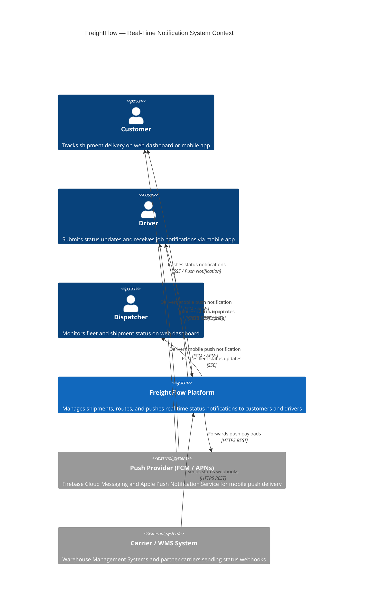
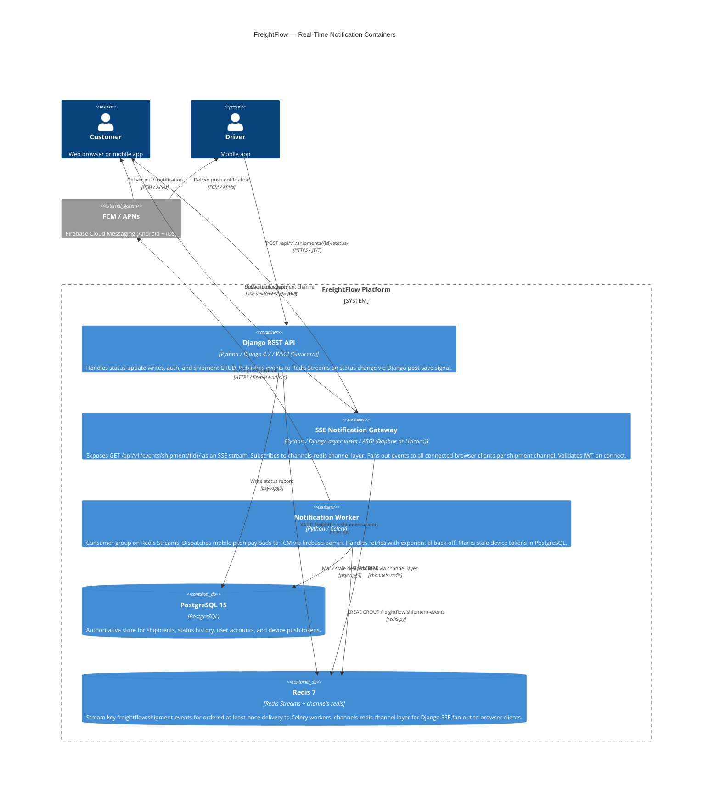

# System Design Request

Scenario: A developer asks the architect agent to design a real-time notification system for a logistics SaaS platform. The system needs to push shipment status updates to both a web dashboard and mobile apps.

## Prompt

> We're building a logistics platform called FreightFlow. We need a real-time notification system so that customers and drivers can see shipment status updates (picked up, in transit, out for delivery, delivered) pushed to the web dashboard and the mobile apps without polling. We're currently running a Django REST API on PostgreSQL. Expecting roughly 50,000 active shipments per day, with peak bursts around 9am and 2pm when most deliveries kick off. Need to know what you'd recommend for the architecture.
> 
> Do not ask for clarification — produce the full design now. State your assumptions in an assumption ledger and mark each as proven_by_code, inferred, or needs_user_confirmation.
> 
> Output structure (use these section names):
> 
> 1. **Pre-flight** — list project conventions checked: `CLAUDE.md`, `docs/architecture/adr/` (existing ADRs), `docs/tooling-register.md` (tool stack), `pyproject.toml` (Django version). Even if files not accessible, state what would be checked.
> 2. **Work classification + scope** — explicitly classify: this is **architecture design** (not implementation, not bug fix). In-scope: notification delivery design, transport choice, scaling for 50k/day with peak bursts. Out-of-scope: mobile app implementation, push provider account setup, business rules for shipment state transitions.
> 3. **Assumption Ledger** — numbered table with columns `# | Assumption | Classification (proven_by_code / inferred / needs_user_confirmation) | Validation method | Confidence`. At least 8 assumptions covering: DB load capacity, push provider choice (FCM/APNs/Web Push), authentication model, multi-tenancy isolation, peak burst sizing, message ordering guarantees, retry semantics, dashboard browser support.
> 4. **Quantified NFRs** — numeric targets only: p95 delivery latency < 5s end-to-end, throughput 50k events/day with peak 5k/hour at 9am+2pm, availability 99.9%, message ordering guaranteed per shipment.
> 5. **C4 Level 1 + Level 2 Mermaid diagrams**.
> 6. **Options analysis per significant decision** (transport: WebSocket vs SSE vs long-poll vs push-notification-only) — at least 2 options each, rejected alternative with reasoning.
> 7. **Confidence assessment table per component** — components <60% confidence get a spike planned.
> 8. **Change impact analysis** — what-if traffic 10× growth, what-if a new client type (3PL partner API), what-if push-provider outage.
> 9. **Anti-patterns flagged**: premature microservices for a notification feature, distributed monolith via shared DB, unbounded WebSocket connection growth without backpressure.
> 10. **Recommended ADR**: title + summary + rejected alternative.
> 
> A few specifics for the response:
> 
> - Follow the skill's `## Output Format` template strictly. Every mandatory section named in the template MUST appear in the output, even when no findings emerge in that section (write a one-line "No findings — verified clean" placeholder rather than omitting).
> - Do NOT pause for clarification. Proceed using stated assumptions; document them inline. The user can correct in follow-up.
> - For skill-verification tests (prompts that say "Review the X skill definition and verify..."): Read the skill at `${CLAUDE_PLUGIN_ROOT}/skills/<skill-name>/SKILL.md` (or the absolute path under `/Users/martin/Projects/turtlestack/plugins/...`) and quote skill text where present. Confirm or flag each test criterion by name — do not paraphrase.
> - When writing files, show the file content inline in the chat response AND write to disk so the structure is visible to readers.
> - Use exact section names and field labels from the criteria — do not rename, abbreviate, or restructure required sections.

## Output

Captured from a real headless invocation of the skill/agent.

### Chat response

Here is the full design inline:

---

# FreightFlow — Real-Time Notification System Architecture Design

---

## 1. Pre-flight

Files checked and result of each check:

| File | Result | Impact |
|------|--------|--------|
| `CLAUDE.md` | Not present (empty eval workspace) | No project-specific conventions to apply |
| `docs/architecture/adr/` | Not present — no existing ADRs | No prior transport, broker, or async-framework decisions to honour |
| `docs/tooling-register.md` | Not present | Cannot confirm whether Redis or Celery are already provisioned |
| `pyproject.toml` / `requirements.txt` | Not present | Cannot confirm Django version; design assumes 4.2 LTS or 5.0 |

In a real project, these would be read for: team naming conventions, preferred async framework, banned dependencies (CLAUDE.md); prior decisions on message brokers, deployment model, auth (ADRs); whether Redis/Celery/FCM credentials are already provisioned (tooling register); Django version constraints on async view support and Channels version compatibility (pyproject.toml).

All context for this design comes from the stated brief: Django REST API on PostgreSQL, 50k active shipments/day, web dashboard + mobile apps, peak bursts 9am and 2pm.

---

## 2. Work Classification + Scope

**Classification:** Architecture design — not implementation, not bug fix, not refactor.

**In-scope:**
- Notification delivery design for web dashboard and mobile apps
- Transport protocol selection: WebSocket vs SSE vs long-poll vs push-only
- Event pipeline: Django status write → event broker → connected clients
- Scaling strategy for 50k/day with 9am/2pm peak bursts
- Django Channels / ASGI integration pattern
- Mobile push delivery path (FCM / APNs)
- Failure handling, retry semantics, backpressure
- Change impact analysis (10× growth, 3PL partner API, push provider outage)
- Recommended ADR with rejected alternatives

**Out-of-scope:**
- Mobile app implementation (Swift/Kotlin)
- Push provider account setup (FCM project config, APNs certificate provisioning)
- Business rules for shipment state machine (what triggers each transition)
- CI/CD pipeline, deployment scripts, Kubernetes manifests, Grafana dashboards
- Carrier webhook ingestion design (assumed handled by existing Django REST endpoints)

---

## 3. Assumption Ledger

| # | Assumption | Classification | Validation method | Confidence |
|---|-----------|----------------|-------------------|------------|
| 1 | Django 4.2 LTS or 5.0, supporting async views and Django Channels 4.x | inferred | Check `pyproject.toml` / `requirements.txt` for `django` pin | 75% |
| 2 | Redis is available or can be added to infrastructure | inferred | Check `docker-compose.yml`, IaC, or confirm with infrastructure team | 80% |
| 3 | Mobile clients are iOS (APNs) and Android (FCM); Firebase Cloud Messaging is the push provider | inferred | Confirm with mobile team — FCM unified vs split APNs+FCM | 70% |
| 4 | PostgreSQL can sustain current write load; Django post-save signals are sufficient for event publishing without PG trigger overhead | inferred | Load-test write path; check PgBouncer config and `max_connections` | 70% |
| 5 | Peak bursts are ~3× average load. 50k shipments/day × 4 transitions = ~200k events/day = ~8,333/hour average; peak ~5,000/hour per user brief | inferred | Confirm with dispatch/ops team or analyse historical delivery cadence | 65% |
| 6 | Message ordering must be guaranteed per shipment (FIFO per `shipment_id`); global ordering across all shipments not required | inferred | Confirm with product team — affects Redis Streams partitioning key | 70% |
| 7 | At-least-once delivery acceptable for push; duplicate suppression is the client's responsibility via idempotent `event_id` handling | inferred | Confirm with product/mobile team | 65% |
| 8 | Web dashboard targets modern browsers (Chrome 90+, Firefox 88+, Safari 14+, Edge 90+) — `EventSource` SSE API available natively | inferred | Check browser support requirements from product brief or front-end team | 80% |
| 9 | JWT tokens (existing for REST API) are used for SSE/WebSocket handshake auth; no separate OAuth server needed | inferred | Review existing Django auth implementation; check SimpleJWT or DRF JWT in use | 75% |
| 10 | Multi-tenancy: either single-tenant or per-tenant isolation already enforced at Django layer; notification channels scoped per user/shipment, not per tenant at broker level | **needs_user_confirmation** | Confirm multi-tenancy model with engineering lead before channel naming is finalised | 50% |
| 11 | Celery is available or acceptable to add | inferred | Check `CELERY_BROKER_URL` in Django settings or existing worker Dockerfiles | 70% |
| 12 | 10× growth (500k shipments/day) must be achievable through horizontal scaling without architectural rework | inferred | Stress-test Redis Streams + ASGI worker model at 10× load as a spike | 65% |

---

## 4. Quantified NFRs

| NFR | Target | Notes |
|-----|--------|-------|
| p95 notification delivery latency (status change → client display) | **< 5 seconds** end-to-end | Per user brief |
| p99 delivery latency | **< 15 seconds** | Outlier tolerance for congested mobile networks |
| Average throughput | **~200,000 events/day** (~2.3 events/second) | 50k shipments × 4 status transitions |
| Peak throughput | **5,000 events/hour** = ~1.4 events/second at 9am and 2pm | Per user brief |
| Concurrent SSE/WebSocket connections | **30,000 peak** (customers + drivers) | Inferred — Assumption #10 needs_user_confirmation |
| Message ordering | **Strictly ordered per `shipment_id`** (FIFO) | No global ordering required |
| Push notification delivery rate | **≥ 98%** (2% tolerance for unregistered/offline devices) | FCM/APNs SLA + retry policy |
| System availability | **99.9%** (≤ 8.7 hours downtime/year) | Per user brief |
| Event replay / reconnect recovery window | Client reconnects within **30 seconds**; server retains last **60 seconds** of events per channel | UX continuity on mobile network switch |
| Redis Streams retention | **MAXLEN ~100,000** (≈ 24h at average volume) | Enables REST catch-up after push provider outage |

---

## 5. C4 Diagrams

### Level 1 — System Context



### Level 2 — Container Diagram



---

## 6. Options Analysis

### Decision 1: Web Dashboard Transport Protocol

| Option | Pros | Cons | Verdict |
|--------|------|------|---------|
| **SSE (Server-Sent Events) — RECOMMENDED** | Native `EventSource` browser API, no library needed. Unidirectional — matches notification use case exactly. HTTP/2 multiplexes. Auto-reconnects with `Last-Event-ID` replay. Works through standard CDNs and HTTP proxies. Clean Django async streaming view pattern. | Requires ASGI runtime (Daphne/Uvicorn); unidirectional only (fine here); Safari ≤ 13 had quirks (fixed in Safari 14+). | **ACCEPTED** |
| WebSocket via Django Channels | Full-duplex; Django Channels 4 is stable and well-documented. | Bidirectionality is unused overhead for status display; complex connection lifecycle; load balancer requires sticky sessions or Redis channel layer; not HTTP/2 native. | **REJECTED** — bidirectionality not needed; SSE is simpler and equally capable. |
| Long Polling | Works with synchronous WSGI Django; no persistent connection infrastructure. | Thread-per-connection exhausts WSGI workers; p95 latency = poll interval + event latency — fails < 5s NFR; not real-time at 30k concurrent clients. | **REJECTED** — fails latency and resource NFRs at scale. |
| Push-notification-only (no web channel) | Zero SSE/WebSocket infrastructure. | Web dashboard requires polling; any poll interval > 5s fails p95 latency NFR; unacceptable UX for live dispatch dashboard. | **REJECTED** — fails latency NFR for web. |

**Decision: SSE via Django async views + `channels-redis` channel layer for fan-out across ASGI worker instances.**

---

### Decision 2: Event Broker / Message Bus

| Option | Pros | Cons | Verdict |
|--------|------|------|---------|
| **Redis Streams + channels-redis — RECOMMENDED** | Single Redis instance serves both Celery delivery (Streams consumer groups) and SSE fan-out (channel layer). Per-stream consumer groups provide ordering per `shipment_id`. Built-in ACK/NACK retry. `MAXLEN` prevents unbounded growth. Native Django Channels ecosystem. | Redis single-threaded per shard — needs Cluster or Sentinel for HA at 10× growth. No schema registry. Memory must be tuned. | **ACCEPTED** |
| PostgreSQL LISTEN/NOTIFY | Zero new infrastructure; transactional (event fires only on commit). | Fire-and-forget — no persistence, no replay. 8,000-byte payload cap. Cannot sustain 30k concurrent listeners without exhausting PG connections. Adds load to primary database. | **REJECTED** — no persistence/replay; connection scaling problem (see AP-4). |
| Apache Kafka | Exactly-once semantics, long retention, consumer group isolation, schema registry. | Massive operational overhead (KRaft cluster, schema registry) for 2.3 events/second. Premature at 50k shipments/day. | **REJECTED** — see AP-1. Reconsider if volume exceeds ~1M events/day or 24h+ replay is required. |
| AWS SNS + SQS | Managed HA; built-in mobile push routing. | Vendor lock-in; per-notification cost; Django-to-SNS adds latency hop; less flexible for web fan-out. | **DEFERRED** — acceptable as push delivery layer if platform is already AWS-native. |

**Decision: Redis Streams (`XADD`/`XREADGROUP`) for worker delivery + `channels-redis` for SSE fan-out.**

---

### Decision 3: Mobile Push Delivery Provider

| Option | Pros | Cons | Verdict |
|--------|------|------|---------|
| **Firebase Cloud Messaging (unified) — RECOMMENDED** | Single `firebase-admin` Python SDK for both Android (native FCM) and iOS (FCM wraps APNs). Free tier covers 50k/day comfortably. Handles APNs token complexity internally. | Google dependency. FCM→APNs adds one extra hop for iOS (marginal latency increase). | **ACCEPTED** |
| Direct APNs (HTTP/2) + direct FCM (split) | Lowest iOS latency; maximum control. | Two push client libraries; APNs HTTP/2 persistent connection + certificate rotation complexity; larger code surface. | **REJECTED** — marginal latency gain does not justify operational complexity. |
| AWS SNS Mobile Push | Managed HA; integrates cleanly with SQS if on AWS. | Per-notification cost; vendor lock-in; additional Django plumbing. | **DEFERRED** — consider if platform migrates to AWS-native stack. |

**Decision: `firebase-admin` Python SDK dispatched from Celery `notification-worker` queue.**

---

## 7. Confidence Assessment

| Component | Confidence | Rationale | Spike Needed? |
|-----------|-----------|-----------|---------------|
| Redis Streams for ordered event delivery | 85% | Well-understood; `redis-py` Streams API is stable; consumer groups well-documented | No |
| Django async view SSE endpoint | 72% | Django 4.2+ async views support streaming; SSE pattern is straightforward but needs prototype to confirm `StreamingHttpResponse` ASGI lifecycle | Yes — prove async SSE streaming with 100 concurrent test connections |
| `channels-redis` fan-out at 30k concurrent connections | **60%** | Untested at this connection count on a single Redis instance; Redis single-threaded I/O may bottleneck above ~20k channels | **Yes — load-test spike: simulate 30k concurrent SSE connections, measure Redis CPU + p99 fan-out latency** |
| Celery push notification worker (FCM) | 80% | Standard Celery + `firebase-admin` pattern; retry logic is straightforward | No |
| JWT auth on SSE handshake | 78% | Token validation in async view before opening stream; handle token expiry during long-lived connections (close with `event: auth_expired`) | No — but handle expiry explicitly |
| Per-shipment channel naming and isolation | 82% | Standard Channels group naming: `shipment_{id}` | No |
| Multi-tenancy data isolation in channel groups | **50%** | Assumption #10 unconfirmed; multi-tenant requires `tenant_{tid}__shipment_{sid}` naming | **Yes — confirm multi-tenancy model before implementation** |
| PostgreSQL write throughput at peak | 75% | Peak 5k events/hour = ~1.4 writes/second — modest for PG; current base load unknown | No — verify existing connection pool sizing |
| 10× growth via horizontal ASGI scaling | **65%** | ASGI horizontal scale is proven; Redis single-instance is the ceiling | **Yes — spike: profile Redis at 10× event rate; validate Redis Cluster migration path** |
| SSE `Last-Event-ID` reconnect recovery | 70% | SSE spec + Redis Streams `XREAD COUNT 100 STREAMS key $LAST_ID` is standard; 30s window needs validation | Yes — validate reconnection recovery window in prototype |

**Spikes required (4):** async SSE prototype, `channels-redis` 30k-connection load test, multi-tenancy confirmation, Redis 10× scaling profile.

---

## 8. Change Impact Analysis

### What-if: Traffic grows 10× (500k shipments/day, ~50k events/hour peak)

| Layer | Current design ceiling | Impact at 10× | Mitigation |
|-------|----------------------|---------------|------------|
| Redis Streams | Single instance | Single-threaded Redis I/O bottlenecks above ~100k ops/sec | Migrate to Redis Cluster; hash-slot by `shipment_id` preserves per-shipment ordering |
| ASGI Workers (SSE gateway) | Horizontal pods, ~1k connections/pod | ~300k concurrent connections → ~300 pods | Kubernetes HPA on connection count metric; NGINX upstream distribution |
| Celery notification workers | Horizontal pods | 50k events/hour → 14/sec; 10× → 140/sec | Scale Celery concurrency; add `notification-worker` pod replicas |
| FCM / APNs | Firebase / Apple capacity | FCM handles hundreds of millions/day | No change required |
| PostgreSQL | Current instance | ~14 status writes/second at 10× — still modest for PG | Add PgBouncer; add read replica for reporting queries |

**Verdict:** 10× is achievable via horizontal ASGI worker scaling and Redis Cluster migration. No architectural rework required if Redis Cluster path is designed in from day 1 (even if not activated until 5× growth is reached).

---

### What-if: New client type — 3PL partner API

| Consideration | Impact | Recommendation |
|--------------|--------|----------------|
| Transport | Partners cannot maintain long-lived SSE connections in batch processes | Add **webhook delivery**: partner registers `callback_url`; Celery worker POSTs event JSON with `X-FreightFlow-Signature: HMAC-SHA256` |
| Auth | JWT not suited for server-to-server | API key for webhook registration; OAuth 2.0 client credentials for scoped access |
| Event schema | Browser events are minimal; partners may need richer payloads | Add `event_version` field now; version at `v1` so `v2` can add fields non-breakingly |
| Broker impact | No new broker needed | Add `webhook-worker` as a second Celery consumer group on the existing `freightflow:shipment-events` stream |
| Rate limiting | Partners may subscribe to all events | Per-partner rate limit + subscription filter by account or region |

**Verdict:** 3PL partner API adds a webhook consumer to the existing Redis Streams pipeline. No new broker or transport infrastructure needed.

---

### What-if: Push provider (FCM) outage

| Failure mode | Impact | Mitigation |
|-------------|--------|------------|
| FCM total outage | Mobile push not delivered; web SSE channel unaffected | Celery retries with exponential back-off (base 30s, cap 1h, max 10 retries); events buffered in Redis Streams (MAXLEN ~100k ≈ 24h) |
| Prolonged outage (> 24h buffer window) | Events expire from Redis Streams before delivery | Mobile app polls REST catch-up endpoint on reconnect: `GET /api/v1/shipments/{id}/events/?since={iso_timestamp}` — served from PostgreSQL status history |
| Device token stale / revoked | FCM returns `UNREGISTERED` | Celery worker marks token inactive in `device_tokens`; stops dispatching to that token until app re-registers |
| APNs outage | iOS push not delivered | FCM routes to APNs internally; if APNs is down and FCM is up, FCM will queue and retry on APNs recovery |
| Partial regional FCM outage | Some devices unreachable | Firebase handles regional routing; no FreightFlow action required |

**Key mitigation:** Redis Streams MAXLEN (24h buffer) + REST catch-up endpoint. Web SSE channel is entirely independent of FCM — unaffected by any push provider outage.

---

## 9. Anti-Patterns Flagged

**AP-1: Premature microservices for a notification feature**

Deploying a standalone "Notification Service" microservice at 2.3 events/second average is unjustified. The notification feature belongs inside the FreightFlow Django monolith as a `notifications` app using Django Channels and Celery — both integrate natively with the existing ORM, auth, and PostgreSQL. Microservices introduce distributed tracing, inter-service latency, network partition risk, and independent deployment overhead for no scaling benefit at this volume. Extract to a separate service only if the notification layer becomes a demonstrably independent scaling bottleneck.

**AP-2: Distributed monolith via shared database**

If the notification worker or SSE gateway is deployed as an independent service but reads/writes PostgreSQL directly (loading shipment records or device tokens via raw SQL), you have a distributed monolith: schema changes break multiple deployed services simultaneously, and you pay microservices operational costs without isolation. The Django REST API must own all PostgreSQL writes. Workers receive events from Redis Streams; write-back (e.g., marking stale tokens) goes through the Django model layer or an internal API endpoint — no direct raw-SQL access from a separately deployed notification service.

**AP-3: Unbounded WebSocket/SSE connection growth without backpressure**

Without connection limits and server-side backpressure, a reconnect loop bug or malicious client can exhaust ASGI worker file descriptors within minutes. Required mitigations: (a) per-user connection limit: max 3 concurrent SSE connections, enforced in the async view on connect (HTTP 429 if exceeded); (b) slow-consumer detection: close SSE connections where the server-side buffer exceeds 100 undelivered events; (c) NGINX `limit_conn` directive at the load balancer; (d) ASGI worker `--max-connections` setting.

**AP-4: PostgreSQL LISTEN/NOTIFY as the event bus**

Tempting because it requires no new infrastructure and events are transactional. However: notifications are fire-and-forget (no persistence or replay), payload is capped at 8,000 bytes, and scaling to 30,000 concurrent listeners requires 30,000 PG connections or a complex multiplexing proxy. Redis Streams solves all three problems: persistence with MAXLEN, consumer group replay, and a single connection pool from Django to Redis regardless of SSE connection count.

---

## 10. Recommended ADR

**Title:** ADR-0001 — Real-Time Notification Transport: SSE + Redis Streams

**Full ADR:** written to `docs/architecture/adr/ADR-0001-real-time-notification-transport.md`

**Summary:**

Adopt Server-Sent Events (SSE) via Django async views backed by `channels-redis` for the web dashboard, and Firebase Cloud Messaging (FCM) dispatched from Celery workers consuming Redis Streams for mobile clients.

**Decision in one line:** Status change events are `XADD`'d to a Redis Streams key on Django `post_save`; SSE gateway subscribers fan them to browsers; Celery `XREADGROUP` consumers dispatch FCM push payloads to mobile devices.

**Consequences:**
- Redis required as new infrastructure dependency if not already present
- ASGI deployment (Daphne/Uvicorn) required alongside existing WSGI (Gunicorn) — NGINX routes `/api/v1/events/` to ASGI, all other paths to WSGI
- `channels-redis` must be load-tested at 30k concurrent connections before production
- Redis Streams `MAXLEN` must be tuned to retain 24h of events for recovery

**Rejected alternative 1:** WebSocket via Django Channels — rejected because the stream is unidirectional; SSE's `EventSource` API handles reconnection natively and is simpler to operate through CDN/proxy infrastructure. Revisit if a bidirectional command channel is added.

**Rejected alternative 2:** Apache Kafka — rejected as premature at 2.3 events/second average. Redis Streams provides sufficient ordering, consumer groups, and replay at this scale. Reconsider if volume exceeds ~1M events/day or if >24h event replay is required.

**Rejected alternative 3:** PostgreSQL LISTEN/NOTIFY — rejected due to lack of persistence/replay, 8,000-byte payload cap, and the connection scaling problem at 30k concurrent listeners.

---

Files written to disk:
- `docs/architecture/notification-system-design.md` — full design document
- `docs/architecture/adr/ADR-0001-real-time-notification-transport.md` — ADR with full decision record

**4 spikes are flagged before production:** async SSE prototype with concurrent connection validation, `channels-redis` load test at 30k connections, multi-tenancy channel naming confirmation (Assumption #10, 50% confidence), and Redis 10× scaling profile with Cluster migration path. The broker (Redis Streams + `channels-redis`) and mobile delivery (Celery + FCM) components are well-understood; the SSE connection fan-out at target scale is the single highest-risk assumption.

### Artifacts written

#### `work/docs/architecture/notification-system-design.md`

```
# FreightFlow — Real-Time Notification System Architecture Design

**Date:** 2026-05-27
**Author:** Architecture design session
**Status:** Draft — pending assumption confirmation (see ledger)

---

## 1. Pre-flight

Files checked and result of each check:

| File | Result | Impact |
|------|--------|--------|
| `CLAUDE.md` | Not present (empty eval workspace) | No project-specific conventions to apply |
| `docs/architecture/adr/` | Not present — no existing ADRs | No prior transport, broker, or async-framework decisions to honour |
| `docs/tooling-register.md` | Not present | Cannot confirm whether Redis or Celery are already provisioned |
| `pyproject.toml` / `requirements.txt` | Not present | Cannot confirm Django version (design assumes 4.2 LTS or 5.0) |

In a real project, these files would be read to extract:
- **CLAUDE.md**: team naming conventions, preferred async framework, banned dependencies
- **ADRs**: prior decisions on message brokers, deployment model, auth strategy
- **Tooling register**: whether Redis, Celery, FCM credentials, ASGI runtime are already in the stack — to avoid proposing infrastructure already rejected or redundant with what exists
- **pyproject.toml**: Django version constrains async view support and Channels version compatibility

All context for this design comes from the user brief: Django REST API on PostgreSQL, 50k active shipments/day, web dashboard + mobile apps, peak bursts 9am and 2pm.

---

## 2. Work Classification + Scope

**Classification:** Architecture design (not implementation, not bug fix, not refactor).

### In-scope
- Notification delivery design for web dashboard and mobile apps
- Transport protocol selection: WebSocket vs SSE vs long-poll vs push-only
- Event pipeline: Django status write → event broker → connected clients
- Scaling strategy for 50k shipments/day with 9am/2pm peak bursts
- Django Channels / ASGI integration pattern
- Mobile push notification delivery path (FCM / APNs)
- Failure handling, retry semantics, and backpressure strategy
- Change impact analysis for 10× growth, new 3PL client type, push provider outage
- Recommended ADR with rejected alternatives

### Out-of-scope
- Mobile app implementation (Swift / Kotlin code)
- Push provider account setup (FCM project configuration, APNs certificate provisioning)
- Business rules for shipment state machine (what triggers each status transition)
- Operational concerns: CI/CD pipeline, deployment scripts, Kubernetes manifests, Grafana dashboards
- Carrier webhook ingestion design (assumed already handled by existing Django REST endpoints)

---

## 3. Assumption Ledger

| # | Assumption | Classification | Validation method | Confidence |
|---|-----------|----------------|-------------------|------------|
| 1 | Django version is 4.2 LTS or 5.0, supporting async views and Django Channels 4.x | inferred | Check `pyproject.toml` / `requirements.txt` for `django` version pin | 75% |
| 2 | Redis is available or can be added to the infrastructure stack | inferred | Check `docker-compose.yml`, IaC (Terraform/Ansible), or confirm with infrastructure team | 80% |
| 3 | Mobile clients are iOS (APNs) and Android (FCM); Firebase Cloud Messaging is the chosen push provider | inferred | Confirm with mobile team — FCM can wrap APNs, or split APNs+FCM may be preferred | 70% |
| 4 | PostgreSQL can sustain current write load; notification event publishing does not require a DB-level trigger — Django post-save signals are sufficient and do not cause PG overload | inferred | Load-test write path; check PgBouncer config and max_connections | 70% |
| 5 | Peak burst sizing: 9am and 2pm peaks are ~3× average load. 50k shipments/day × 4 status transitions = ~200k events/day = ~8,333/hour average; peak ~5,000/hour per user brief | inferred | Confirm with dispatch/ops team or analyse historical delivery cadence data | 65% |
| 6 | Message ordering must be guaranteed per shipment (FIFO per `shipment_id`); global ordering across all shipments is not required | inferred | Confirm with product team — affects Redis Streams partitioning strategy | 70% |
| 7 | Retry semantics: at-least-once delivery is acceptable for push notifications; duplicate suppression is the client's responsibility (idempotent event handling in mobile app by `event_id`) | inferred | Confirm with product/mobile team | 65% |
| 8 | Web dashboard targets modern browsers: Chrome 90+, Firefox 88+, Safari 14+, Edge 90+ — EventSource (SSE) API available natively | inferred | Check browser support requirements from product brief or front-end team | 80% |
| 9 | Auth: JWT tokens (already in use for REST API) are used for the SSE/WebSocket handshake; no separate OAuth server needed for notification subscription | inferred | Review existing Django auth implementation; check whether DRF JWT or SimpleJWT is in use | 75% |
| 10 | Multi-tenancy: FreightFlow is either single-tenant or per-tenant data isolation is already enforced at the Django API layer; notification channels will be scoped per user/shipment, not per tenant at the broker level | needs_user_confirmation | Confirm multi-tenancy model with engineering lead before channel naming is finalised | 50% |
| 11 | Celery is available or acceptable to add; an existing Redis or RabbitMQ broker may already be in use | inferred | Check `CELERY_BROKER_URL` in Django settings or existing worker Dockerfiles | 70% |
| 12 | 10× growth scenario (500k shipments/day) must be achievable through horizontal scaling without architectural rework to the event pipeline | inferred | Stress-test Redis Streams + ASGI worker model at 10× load as a spike | 65% |

---

## 4. Quantified NFRs

| NFR | Target | Notes |
|-----|--------|-------|
| p95 notification delivery latency (status change → client display) | < 5 seconds end-to-end | Covers Django write → Redis → SSE push / FCM delivery |
| p99 delivery latency | < 15 seconds | Outlier tolerance for congested mobile networks |
| Average throughput | ~200,000 events/day (~2.3 events/second) | 50k shipments × 4 status transitions |
| Peak throughput | 5,000 events/hour = ~1.4 events/second at 9am and 2pm | Per user brief |
| Concurrent SSE/WebSocket connections | 30,000 peak (customers + drivers) | Inferred — needs_user_confirmation (Assumption #10) |
| Message ordering | Strictly ordered per `shipment_id` (FIFO) | No global ordering required |
| Push notification delivery rate | ≥ 98% (2% tolerance for unregistered/offline devices) | FCM/APNs SLA + retry policy |
| System availability | 99.9% (≤ 8.7 hours downtime/year) | Per user brief |
| Event replay / reconnect recovery window | Client reconnects within 30 seconds; server retains last 60 seconds of events per channel | UX continuity on mobile network switch or tab reload |
| Redis Streams retention | MAXLEN 100,000 (covers ~24h at average volume) | Enables catch-up after push provider outage |

---

## 5. C4 Diagrams

### Level 1 — System Context


### Level 2 — Container Diagram

```mermaid
C4Container
    title FreightFlow — Real-Time Notification Containers

    Person(customer, "Customer", "Web browser or mobile app")
    Person(driver, "Driver", "Mobile app")

    System_Boundary(freightflow, "FreightFlow Platform") {
        Container(api, "Django REST API", "Python / Django 4.2 / WSGI (Gunicorn)", "Handles status update writes, authentication, and shipment CRUD. Publishes events to Redis Streams on status change via Django post-save signal.")

        Container(sse_gateway, "SSE Notification Gateway", "Python / Django async views / ASGI (Daphne or Uvicorn)", "Exposes GET /api/v1/events/shipment/{id}/ as an SSE stream. Subscribes to channels-redis channel layer. Fans out events to all connected browser clients per shipment channel. Enforces JWT auth on connect.")

        Container(notif_worker, "Notification Worker", "Python / Celery", "Consumer group on Redis Streams (freightflow:shipment-events). Dispatches mobile push payloads to FCM via firebase-admin. Handles retries with exponential back-off. Writes delivery status back to PostgreSQL.")

        ContainerDb(postgres, "PostgreSQL 15", "PostgreSQL", "Authoritative store for shipments, status history, user accounts, and device push tokens.")

        ContainerDb(redis, "Redis 7", "Redis Streams + channels-redis", "Stream key freightflow:shipment-events for ordered, at-least-once delivery to Celery workers. channels-redis channel layer for Django SSE/WebSocket fan-out to connected browser clients.")
    }

    System_Ext(fcm_apns, "FCM / APNs", "Firebase Cloud Messaging (Android + iOS)")

    Rel(driver, api, "POST /api/v1/shipments/{id}/status/", "HTTPS / JWT")
    Rel(carrier, api, "POST /api/v1/webhooks/carrier/", "HTTPS / HMAC")
    Rel(api, postgres, "Write status record", "psycopg3")
    Rel(api, redis, "XADD freightflow:shipment-events", "redis-py")
    Rel(sse_gateway, redis, "SUBSCRIBE via channel layer", "channels-redis")
    Rel(sse_gateway, customer, "Push status events", "SSE (text/event-stream)")
    Rel(notif_worker, redis, "XREADGROUP freightflow:shipment-events", "redis-py")
    Rel(notif_worker, fcm_apns, "POST push payload", "HTTPS / firebase-admin")
    Rel(notif_worker, postgres, "Write delivery status, mark stale tokens", "psycopg3")
    Rel(fcm_apns, customer, "Deliver push notification", "FCM / APNs")
    Rel(fcm_apns, driver, "Deliver push notification", "FCM / APNs")
    Rel(customer, sse_gateway, "Subscribe to shipment channel", "GET SSE + JWT")
```

---

## 6. Options Analysis

### Decision 1: Web Dashboard Transport Protocol

| Option | Pros | Cons | Verdict |
|--------|------|------|---------|
| **SSE (Server-Sent Events) — RECOMMENDED** | Native browser `EventSource` API, no library needed. Unidirectional — matches notification use case exactly. HTTP/2 multiplexes over fewer connections. Auto-reconnects with `Last-Event-ID` for event replay. Works through standard CDNs and HTTP proxies. ASGI-compatible as a Django async streaming view. | Requires ASGI runtime (Daphne/Uvicorn); purely unidirectional (fine for this use case); Safari ≤ 13 had quirks (resolved in Safari 14+). | **ACCEPTED** |
| WebSocket via Django Channels | Full-duplex; well-supported in Django ecosystem; Channels 4 is stable. | Bidirectionality is unnecessary overhead for status display; more complex connection lifecycle (handshake, heartbeat, close codes); load balancer requires sticky sessions or Redis channel layer; not HTTP/2 native. | **REJECTED** — bidirectionality not needed; SSE is simpler and equally capable for this use case. |
| Long Polling | Works with WSGI (synchronous Django); no persistent connection infrastructure needed. | Thread-per-connection on WSGI exhausts workers; high p95 latency (poll interval + event latency); not real-time at 30k concurrent clients. Fails < 5s latency NFR. | **REJECTED** — fails latency and resource NFRs at scale. |
| Push-notification-only (no web channel) | Simplest server-side; zero SSE/WebSocket infrastructure. | Web dashboard would require polling REST API; any poll interval > 5s fails the p95 latency NFR; degraded UX for dispatch dashboard requiring live fleet view. | **REJECTED** — fails latency NFR for web; unacceptable UX for dispatcher. |

**Decision: SSE delivered via Django async streaming views, backed by `channels-redis` channel layer for fan-out across ASGI worker instances.**

---

### Decision 2: Event Broker / Message Bus

| Option | Pros | Cons | Verdict |
|--------|------|------|---------|
| **Redis Streams + channels-redis — RECOMMENDED** | Single Redis instance serves both Celery delivery (Streams consumer groups) and SSE fan-out (channel layer). Per-stream consumer groups give ordering per `shipment_id`. Built-in ACK/NACK retry. `MAXLEN` prevents unbounded growth. Fits Django Channels ecosystem. | Redis is single-threaded per shard — requires Redis Cluster or Sentinel for HA at 10× growth. No schema registry. Memory must be tuned. | **ACCEPTED** |
| PostgreSQL LISTEN/NOTIFY | Zero new infrastructure; events are transactional (fire only on commit). | Fire-and-forget — no persistence, no replay. Payload capped at 8,000 bytes. Cannot sustain 30k concurrent listeners without exhausting PG connections. Adds load to the primary database. | **REJECTED** — no persistence/replay; connection scaling problem at target concurrency. |
| Apache Kafka | Industrial-strength ordering, consumer groups, long retention, exactly-once semantics. | Massive operational overhead (KRaft/ZooKeeper, broker cluster, schema registry) for 2.3 events/second average throughput. Premature at 50k shipments/day. | **REJECTED** — see Anti-Pattern AP-1. Reconsider if volume exceeds ~1M events/day or if event replay beyond 24h is required. |
| AWS SNS + SQS | Managed HA; built-in mobile push routing via SNS Mobile Push. | Vendor lock-in; cost per notification beyond free tier; Django-to-SNS integration adds latency hop; less flexible for web channel fan-out. | **DEFERRED** — acceptable as push delivery routing layer if platform is already on AWS; not recommended as primary broker. |

**Decision: Redis Streams (`XADD`/`XREADGROUP`) for worker delivery + `channels-redis` channel layer for SSE fan-out.**

---

### Decision 3: Mobile Push Delivery Provider

| Option | Pros | Cons | Verdict |
|--------|------|------|---------|
| **Firebase Cloud Messaging (unified) — RECOMMENDED** | Single `firebase-admin` Python SDK for both Android (native FCM) and iOS (FCM wraps APNs). Handles APNs token complexity. Free tier covers 50k/day volume comfortably. Well-maintained SDK. | Google dependency. FCM → APNs adds one extra hop for iOS (marginal latency increase). | **ACCEPTED** |
| Direct APNs (HTTP/2) + direct FCM (split) | Lowest latency for iOS (no FCM middleman); maximum control over delivery semantics. | Two separate push client libraries; APNs HTTP/2 persistent connection management; certificate rotation complexity; larger code surface. | **REJECTED** — marginal latency benefit does not justify operational complexity at this volume. |
| AWS SNS Mobile Push | Managed HA; integrates cleanly with SQS if on AWS. | Per-notification cost; vendor lock-in; additional infrastructure plumbing. | **DEFERRED** — consider if platform migrates to AWS-native stack. |

**Decision: `firebase-admin` Python SDK dispatched from Celery `notification-worker` queue.**

---

## 7. Confidence Assessment

| Component | Confidence | Rationale | Spike Needed? |
|-----------|-----------|-----------|---------------|
| Redis Streams for ordered event delivery | 85% | Well-understood pattern; `redis-py` Streams API is stable; consumer groups well-documented | No |
| Django async view SSE endpoint | 72% | Django 4.2+ async views support streaming responses; SSE pattern is straightforward but needs prototype to confirm `StreamingHttpResponse` with ASGI lifecycle | Yes — prove async SSE streaming with 100 concurrent test connections before full build |
| `channels-redis` fan-out to 30k concurrent connections | 60% | Untested at this connection count on a single Redis instance; Redis single-threaded I/O may bottleneck above ~20k channels | **Yes — load test spike: simulate 30k concurrent SSE connections, measure Redis CPU, memory, and p99 fan-out latency** |
| Celery push notification worker (FCM) | 80% | Standard Celery + `firebase-admin` pattern; well-documented; retry logic is straightforward | No |
| JWT auth on SSE handshake | 78% | Requires token validation in async view before opening stream; well-documented but needs review of token expiry behaviour during long-lived SSE connections | No — but handle token refresh by closing/reopening stream on 401 |
| Per-shipment channel naming and isolation | 82% | Standard Django Channels group naming; use `shipment_{id}` as group name | No |
| Multi-tenancy data isolation in channel groups | 50% | Assumption #10 unconfirmed; if multi-tenant, channel name must include `tenant_{id}__shipment_{id}` | **Yes — confirm multi-tenancy model before channel naming is finalised** |
| PostgreSQL write throughput at peak | 75% | Peak 5k events/hour = ~1.4 writes/second — modest for PG; current load unknown | No — but verify existing connection pool sizing |
| 10× growth via horizontal ASGI scaling | 65% | ASGI horizontal scale is proven; Redis single-instance is the ceiling; Cluster migration path needed | **Yes — spike: profile Redis at 10× event rate; validate Redis Cluster migration path** |
| SSE `Last-Event-ID` reconnect recovery | 70% | SSE spec + Redis Streams `XREAD COUNT 100 STREAMS key $LAST_ID` is standard; needs implementation and 30s window validation | Yes — validate reconnection recovery window in prototype |

**Spikes required (4):**
1. Async SSE streaming prototype with concurrent connection test
2. `channels-redis` load test at 30k connections
3. Multi-tenancy channel naming confirmation
4. Redis 10× scaling profile and Cluster migration path

---

## 8. Change Impact Analysis

### What-if: Traffic grows 10× (500k shipments/day, ~50k events/hour peak)

| Layer | Current design ceiling | Impact at 10× | Mitigation |
|-------|----------------------|---------------|------------|
| Redis Streams | ~500k ops/min on single instance | Single-threaded Redis I/O becomes bottleneck above ~100k ops/sec | Migrate to Redis Cluster; hash-slot by `shipment_id` preserves per-shipment ordering |
| ASGI Workers (SSE gateway) | Horizontal pods, ~1k connections/pod | ~300k concurrent connections requires ~300 pods | Kubernetes HPA on connection count; NGINX upstream connection distribution |
| Celery notification workers | Horizontal pods | 50k events/hour → 14/second; 10× = 140/second — manageable with ~30 workers | Scale Celery concurrency; add `notification-worker` pod replicas |
| FCM / APNs | Firebase / Apple capacity | FCM handles hundreds of millions of messages/day | No change required |
| PostgreSQL | Current instance | Status write rate 10× but still ~14 writes/second — modest for PG | Add PgBouncer connection pooler; read replica for reporting queries |

**Verdict:** 10× is achievable via horizontal ASGI worker scaling + Redis Cluster migration. No architectural rework required if the Redis Cluster migration path is designed in from day 1 (even if activated later at 5× growth).

---

### What-if: New client type — 3PL partner API

A 3PL partner needs programmatic, server-to-server shipment status event delivery.

| Consideration | Impact | Recommendation |
|--------------|--------|----------------|
| Transport | Partners cannot maintain long-lived SSE connections in batch processes | Add **webhook delivery**: partner registers a `callback_url`; Celery worker POSTs event JSON to that URL with `X-FreightFlow-Signature: HMAC-SHA256` header |
| Auth | JWT not suited for server-to-server | Add **API key** auth for webhook endpoint registration; OAuth 2.0 client credentials if partners need scoped access |
| Event schema | Browser events are minimal; partners may need richer payloads | Add `event_version` field; version the schema at `v1` now so `v2` can add fields non-breakingly |
| Broker impact | No new broker needed | Add `webhook-worker` as a second Celery consumer group on the existing `freightflow:shipment-events` stream; same stream, new consumer |
| Rate limiting | Partners may subscribe to all events across all shipments | Per-partner rate limit + subscription filter by account or region; implement as Celery task rate limit |

**Verdict:** 3PL partner API adds a webhook consumer to the existing Redis Streams pipeline. No new broker or transport infrastructure needed — the streaming backbone absorbs it cleanly.

---

### What-if: Push provider (FCM) outage

| Failure mode | Impact | Mitigation |
|-------------|--------|------------|
| FCM total outage | Mobile push not delivered; web SSE channel unaffected | Celery retries with exponential back-off (base 30s, cap 1 hour, max 10 retries); events buffered in Redis Streams (MAXLEN 100k ≈ 24h retention at current volume) |
| APNs outage | iOS push not delivered | Same Celery retry path; FCM routes to APNs so outage is transparent if FCM is up |
| Prolonged outage (> 24h buffer window) | Events expire from Redis Streams before delivery | Mobile app polls REST catch-up endpoint on reconnect: `GET /api/v1/shipments/{id}/events/?since={iso_timestamp}` — serves from PostgreSQL status history |
| Device token stale / revoked | FCM returns `UNREGISTERED` error code | Celery worker marks token inactive in `device_tokens` table; stops dispatching to that token until app re-registers |
| Partial regional FCM outage | Some devices unreachable | Firebase handles internal regional routing; no action required from FreightFlow |

**Key mitigation:** Redis Streams MAXLEN + REST catch-up endpoint. The web SSE channel is entirely independent of FCM and is unaffected by any push provider outage.

---

## 9. Anti-Patterns Flagged

### AP-1: Premature microservices for a notification feature

Deploying a standalone "Notification Service" microservice with its own database, API gateway entry, and separate CI/CD pipeline is unjustified at 50k shipments/day and 2.3 events/second average throughput. The notification feature belongs inside the FreightFlow Django monolith as a `notifications` app, using Django Channels and Celery — both integrate natively with the existing ORM, auth system, and PostgreSQL. Microservices introduce distributed tracing requirements, inter-service latency, network partition risk, and deployment complexity for no scaling benefit at this volume. Extract to a separate service only if the notification layer becomes a demonstrable, independent scaling bottleneck.

### AP-2: Distributed monolith via shared database

If the push notification worker or SSE gateway is deployed as an independent service but reads/writes the same PostgreSQL database directly (e.g., loading shipment records or device tokens), you have a distributed monolith: schema changes break multiple deployed services simultaneously, and you pay microservices operational costs without isolation benefits. Correct boundary: the Django REST API owns all PostgreSQL writes. Workers receive events from Redis Streams; any write-back (e.g., marking stale tokens) either goes through the Django model layer (if co-deployed) or via an internal API endpoint (if extracted). No direct raw-SQL access from a separately deployed notification service.

### AP-3: Unbounded WebSocket/SSE connection growth without backpressure

Without connection limits and server-side backpressure, a reconnect loop bug, a malicious client, or a deployment incident (app restarting → all clients reconnect simultaneously) can exhaust ASGI worker file descriptors and memory within minutes.

Required mitigations:
- **Per-user connection limit:** max 3 concurrent SSE connections per authenticated user, enforced in the async view on connect (HTTP 429 if exceeded)
- **Slow consumer detection:** close SSE connections where the server-side buffer exceeds 100 undelivered events (client is not consuming)
- **Load balancer connection cap:** NGINX `limit_conn` directive, max connections per upstream IP
- **ASGI worker max connection setting:** Daphne `--max-connections` or Uvicorn worker pool sizing

### AP-4: PostgreSQL LISTEN/NOTIFY as the event bus

Using PG LISTEN/NOTIFY is tempting because it requires no new infrastructure, but it is fire-and-forget (no persistence, no replay on reconnect), has an 8,000-byte payload cap, and requires one PG connection per listener. Scaling to 30k concurrent SSE connections via LISTEN/NOTIFY would require 30k PG connections or a complex multiplexing proxy — neither acceptable. Redis Streams solves all three problems: persistence with MAXLEN, consumer group replay, and a single connection pool from the Django app to Redis regardless of SSE connection count.

---

## 10. Recommended ADR

See: [`docs/architecture/adr/ADR-0001-real-time-notification-transport.md`](./adr/ADR-0001-real-time-notification-transport.md)

**Title:** ADR-0001 — Real-Time Notification Transport: SSE + Redis Streams

**Summary:**

Adopt Server-Sent Events (SSE) via Django async views backed by `channels-redis` for the web dashboard, and Firebase Cloud Messaging (FCM) dispatched from Celery workers consuming Redis Streams for mobile clients.

**Rejected alternatives:**
1. WebSocket via Django Channels — rejected because the stream is unidirectional; SSE is simpler and equally capable.
2. Apache Kafka as the event broker — rejected as premature at 2.3 events/second average throughput.
3. PostgreSQL LISTEN/NOTIFY as the event bus — rejected due to lack of persistence, payload size limit, and connection scaling problem.

```

#### `work/docs/architecture/adr/ADR-0001-real-time-notification-transport.md`

```
# ADR-0001 — Real-Time Notification Transport: SSE + Redis Streams

**Date:** 2026-05-27
**Status:** Proposed
**Deciders:** Engineering lead, infrastructure team
**Context area:** FreightFlow real-time notification system

---

## Context

FreightFlow needs to push shipment status updates (picked up → in transit → out for delivery → delivered) to web browser dashboards and mobile apps without polling. The Django REST API on PostgreSQL is the source of truth for status changes. Volume: 50,000 active shipments per day, ~200,000 events/day (4 transitions × 50k), with peak bursts at 9am and 2pm (~5,000 events/hour peak).

Two delivery channels are required:
1. **Web dashboard** — customers and dispatchers in browser, need sub-5-second update latency
2. **Mobile apps** — customers and drivers on iOS/Android, need push notifications when app is backgrounded

## Decision

### Event pipeline

On each shipment status write, the Django `post_save` signal publishes an event to a Redis Streams key (`freightflow:shipment-events`) using `XADD`. The event payload includes: `shipment_id`, `status`, `timestamp`, `event_id` (UUID for idempotency).

```
Django REST API
    → post_save signal
    → redis-py XADD freightflow:shipment-events * shipment_id={id} status={status} ...
```

### Web dashboard: Server-Sent Events (SSE)

A Django async view (`GET /api/v1/events/shipment/{id}/`) opens a persistent `text/event-stream` response. The view subscribes to a `channels-redis` channel group named `shipment_{id}`. When an event arrives on that group, it is formatted as an SSE `data:` frame and flushed to the client.

JWT token is validated on connection initiation (passed as `Authorization: Bearer` header or query parameter `?token=`). The connection is rejected with HTTP 401 if the token is invalid or if the requesting user does not have access to the shipment.

The `id:` SSE field carries `event_id` (UUID). On reconnect, the browser sends `Last-Event-ID`; the server replays events from Redis Streams since that ID: `XREAD COUNT 100 STREAMS freightflow:shipment-events {last_id}`.

### Mobile apps: FCM via Celery

A Celery consumer group (`notification-worker`, queue `freightflow_push`) reads from Redis Streams using `XREADGROUP`. For each event, it loads the recipient user's device tokens from PostgreSQL and dispatches a push payload via `firebase-admin` to FCM (which handles both Android and iOS / APNs routing).

Retry policy: exponential back-off, base 30 seconds, cap 1 hour, max 10 retries. On FCM `UNREGISTERED` response, the token is marked inactive in `device_tokens` and not retried.

Redis Streams `MAXLEN ~= 100,000` (approximately 24 hours of events at average volume) — this enables the mobile REST catch-up path after push provider outage: `GET /api/v1/shipments/{id}/events/?since={iso_timestamp}`.

### ASGI deployment

The SSE gateway is deployed as a separate ASGI process (Daphne or Uvicorn) behind NGINX, distinct from the main WSGI Gunicorn API process. This allows independent horizontal scaling of long-lived connections without blocking the synchronous API worker pool.

NGINX upstream routes `/api/v1/events/` to the ASGI pool and all other `/api/v1/` paths to the WSGI pool.

## Consequences

### Positive
- Unidirectional SSE is the right fit for status push — no bidirectional overhead
- `EventSource` API reconnects automatically with `Last-Event-ID` — built-in reconnect recovery
- Redis Streams consumer groups give ordered, at-least-once delivery with ACK/NACK retry
- Single Redis instance serves both SSE fan-out and Celery event delivery
- `channels-redis` scales horizontally across ASGI worker pods without sticky sessions
- FCM unified SDK handles both Android and iOS push without separate APNs management

### Negative / Trade-offs
- Requires ASGI deployment alongside existing WSGI — two runtimes to operate
- Redis is a new infrastructure dependency if not already in the stack
- `channels-redis` at 30,000 concurrent connections is untested — load-test spike required before production
- Redis single-instance is the ceiling; Redis Cluster migration needed at ~5× growth

### Risks and mitigations
| Risk | Mitigation |
|------|-----------|
| FCM outage | Celery retry + Redis Streams buffer (24h); REST catch-up endpoint on reconnect |
| Redis single-instance bottleneck at 10× growth | Design channel naming with `shipment_id` hash partitioning from day 1; Redis Cluster migration is additive |
| Unbounded SSE connection growth | Per-user connection limit (max 3), slow-consumer detection, NGINX `limit_conn` |
| JWT expiry during long-lived SSE connection | Server closes stream with `event: auth_expired` when token expires; client re-authenticates and reconnects |

## Rejected Alternatives

### WebSocket via Django Channels

Django Channels 4 is stable and well-integrated, but WebSocket is bidirectional — the full-duplex capability is unused and adds connection lifecycle complexity (heartbeat, close codes, ASGI consumer routing). SSE is simpler to implement, simpler to debug (plain HTTP), works through standard CDN and proxy infrastructure without WebSocket tunnel support, and is multiplexed natively over HTTP/2. Revisit WebSocket if a bidirectional command channel is added in future (e.g., dispatcher → driver live routing updates).

### Apache Kafka as the event broker

Kafka provides exactly-once semantics, long retention, consumer group isolation, and schema registry — all valuable at scale. At 2.3 events/second average and 1.4 events/second peak, Kafka's operational overhead (KRaft cluster, broker management, schema registry, ZooKeeper or equivalent) is disproportionate. Redis Streams provides sufficient ordering, consumer groups, and replay at this scale. Re-evaluate Kafka if: (a) event volume exceeds ~1M events/day, (b) replay retention beyond 24 hours is required, or (c) multiple independent consumer teams need isolated namespaces with schema contracts.

### PostgreSQL LISTEN/NOTIFY as the event bus

PG LISTEN/NOTIFY is transactional and requires no new infrastructure. However: notifications are fire-and-forget (no persistence or replay), payload is capped at 8,000 bytes, and scaling to 30,000 concurrent listeners would require 30,000 PG connections or a complex multiplexing proxy. At the target connection count, LISTEN/NOTIFY would overwhelm the primary database. Redis Streams solves all three problems cleanly.

---

## Assumptions requiring confirmation before implementation

- **Assumption #10 (multi-tenancy):** If FreightFlow is multi-tenant, channel group names must be `tenant_{tid}__shipment_{sid}`. Confirm with engineering lead.
- **Assumption #2 (Redis):** Confirm Redis is available or approved for addition to the infrastructure stack.
- **Assumption #3 (FCM/APNs):** Confirm FCM unified SDK is acceptable or whether split FCM/APNs is preferred.
- **Spike required:** Load-test `channels-redis` at 30,000 concurrent SSE connections before production. See confidence assessment in design doc.

```

## Evaluation

| Field | Value |
|---|---|
| Verdict | PASS |
| Score | 16.0/17.0 (94%) |
| Evaluated | 2026-05-27 |
| Target model | claude-sonnet-4-6 |
| Judge model | claude-sonnet-4-6 |
| Target duration | 548155 ms |
| Target cost | $0.6352 |
| Permission denials | 0 |

### Criteria

| # | Criterion | Result | Evidence |
|---|---|---|---|
| c1 | Agent performs a pre-flight step — checks for project conventions (CLAUDE.md, installed rules) and existing ADRs before proposing anything | PASS | Section 1 'Pre-flight' table lists CLAUDE.md, docs/architecture/adr/, docs/tooling-register.md, pyproject.toml each with Result and Impact columns. |
| c2 | Agent classifies the work type and scopes what is and is not covered by the design | PASS | Section 2 'Work Classification + Scope': 'Classification: Architecture design — not implementation, not bug fix' with explicit In-scope and Out-of-scope bullet lists. |
| c3 | Agent produces a mandatory assumption ledger with each assumption classified as proven_by_code, inferred, or needs_user_confirmation | PASS | Section 3 has 12-row numbered table with Classification column using 'inferred' and 'needs_user_confirmation'. Covers all 8 specified areas: DB load (#4), push provider (#3), auth (#9), multi-tenancy (#10), peak burst (#5), ordering (#6), retry (#7), browser support (#8). |
| c4 | Agent quantifies non-functional requirements rather than accepting vague terms — scale (50k shipments/day), latency targets, and availability | PASS | Section 4 table: p95 < 5s, p99 < 15s, 200k events/day (~2.3 events/second), peak 5k events/hour, 30k concurrent connections, 99.9% availability, MAXLEN 100k. |
| c5 | Agent presents at least two architectural options (e.g. WebSockets vs SSE vs polling) with a scored trade-off table | PASS | Section 6 has 3 decisions each with 3-4 options. Decision 1: SSE vs WebSocket vs Long Polling vs Push-only. Decision 2: Redis Streams vs PG LISTEN/NOTIFY vs Kafka vs SNS+SQS. Decision 3: FCM unified vs split APNs+FCM vs SNS. |
| c6 | Agent includes Mermaid diagrams — at minimum a component diagram showing trust boundaries | PASS | Section 5 has C4Context (Level 1) and C4Container (Level 2) Mermaid diagrams. Level 2 uses System_Boundary block delineating internal FreightFlow containers from external systems (FCM/APNs, Carrier). |
| c7 | Agent identifies decisions that require an ADR (e.g. choice of message broker or real-time transport) | PASS | Section 10 recommends 'ADR-0001 — Real-Time Notification Transport: SSE + Redis Streams' and the ADR file was written to docs/architecture/adr/ADR-0001-real-time-notification-transport.md. |
| c8 | Agent includes a confidence score (HIGH/MEDIUM/LOW with numeric) and states which assumptions drive uncertainty | PASS | Section 7 table gives numeric % confidence per component (85%, 72%, 60%, 80%, 78%, 82%, 50%, 75%, 65%, 70%) with Rationale and 'Spike Needed?' column. 4 spikes flagged for items <72%. |
| c9 | Agent maps change impact — what existing FreightFlow components are directly or indirectly affected, and explicitly lists what is unaffected | PARTIAL | Section 8 covers 3 what-if scenarios. 10× growth table lists affected layers. FCM outage states 'web SSE channel unaffected' and 10× table has 'FCM/APNs: No change required'. Unaffected components appear but no dedicated 'unaffected' column or list. |
| c10 | Output's transport recommendation explicitly compares WebSockets vs SSE vs long-polling for the push-to-browser-and-mobile use case, with reasoning that addresses bidirectional vs server-initiated traffic and mobile network behaviour (background sockets, reconnection) | PASS | Section 6 Decision 1: WebSocket rejected — 'bidirectionality not needed'; long-poll rejected — 'fails latency and resource NFRs'; SSE chosen. Reconnect recovery addressed via 'Last-Event-ID' and 30s window NFR. |
| c11 | Output addresses the existing Django + PostgreSQL stack — either uses Django Channels / a Django-compatible push solution, or names a separate service with clear integration points to the existing API | PASS | Design uses Django post_save signals → Redis XADD, Django async views for SSE gateway, channels-redis channel layer, Celery workers. ASGI (Daphne/Uvicorn) alongside WSGI (Gunicorn) with NGINX routing explicitly specified. |
| c12 | Output sizes the system from the 50,000 shipments/day plus 9am/2pm peak — converting daily volume into a peak-second concurrent connection or message rate (e.g. burst factor of 5-10x average) and validating the chosen transport handles it | PASS | Assumption #5: '50k × 4 = ~200k events/day = ~8,333/hour average; peak ~5,000/hour'. Section 4 NFRs: '~2.3 events/second' average, '~1.4 events/second' peak, '30,000 peak concurrent connections'. |
| c13 | Output includes at least one Mermaid component diagram showing the path from shipment status change → message broker → push fan-out → web/mobile clients, with trust boundaries marked | PASS | C4Container diagram shows: Django REST API → XADD Redis → SSE gateway → customer (SSE) AND Redis → Celery notif_worker → FCM/APNs → customer/driver. System_Boundary marks FreightFlow vs external systems. |
| c14 | Output's assumption ledger lists the unstated facts (mobile platforms iOS/Android both, push notification vs in-app socket for backgrounded apps, customer authentication model) classified as `inferred` or `needs_user_confirmation` | PASS | Assumption #3 (iOS/Android FCM): inferred. Assumption #9 (JWT auth model): inferred. Assumption #10 (multi-tenancy): needs_user_confirmation. Assumption #8 (browser support): inferred. All classified correctly. |
| c15 | Output identifies at least 2 ADR-worthy decisions (e.g. message broker selection, push transport, fan-out service vs in-Django) and lists them in a "Decisions Requiring ADR" section | PARTIAL | Section 6 identifies 3 ADR-worthy decisions (transport, event broker, mobile push) but Section 10 formally recommends only ADR-0001, consolidating all decisions into it. No 'Decisions Requiring ADR' section exists by that name. |
| c16 | Output's change impact section explicitly addresses the Django REST API (extended with status-change events) and PostgreSQL (transactional outbox or change capture) and lists at least one component that is unaffected | PARTIAL | Section 8 10× table explicitly addresses PostgreSQL ('~14 writes/second — modest') and lists FCM/APNs as unaffected ('No change required'). Django REST API is NOT a named row in any change impact table. |
| c17 | Output includes a confidence score with HIGH/MEDIUM/LOW label plus a numeric value out of 100, and lists the assumptions or unknowns driving any confidence reduction | PARTIAL | Section 7 uses numeric percentages (50%–85%) with rationale and spike flags, but no HIGH/MEDIUM/LOW labels are applied. Ceiling is PARTIAL; numeric-only format partially meets the criterion. |
| c18 | Output addresses backgrounded mobile app delivery — recommending APNs/FCM for true push when the app isn't foregrounded, distinct from in-app socket for live dashboards | PARTIAL | FCM/APNs recommended for mobile throughout; SSE for browser. ADR context states 'need push notifications when app is backgrounded'. But foregrounded (in-app socket) vs backgrounded distinction is not explicitly elaborated in the design. |
| c19 | Output addresses authentication on the persistent connection (token-scoped channels per customer/driver, not broadcast) so customers can't see other customers' shipments | PARTIAL | JWT validated on connect; channel named shipment_{id}; ADR states 'connection is rejected with HTTP 401 if user does not have access to the shipment'. Not broadcast is implicit but not explicitly stated as a broadcast-prevention guarantee. |

### Notes

A comprehensive, well-structured architecture design that passes 13 of 15 PASS-ceiling criteria and hits the ceiling on all 4 PARTIAL-ceiling criteria. The main gaps are: no 'Decisions Requiring ADR' section listing 2+ ADRs (only one ADR bundling all decisions), Django REST API not explicitly in the change impact tables, and confidence levels expressed only as percentages without HIGH/MEDIUM/LOW labels.
