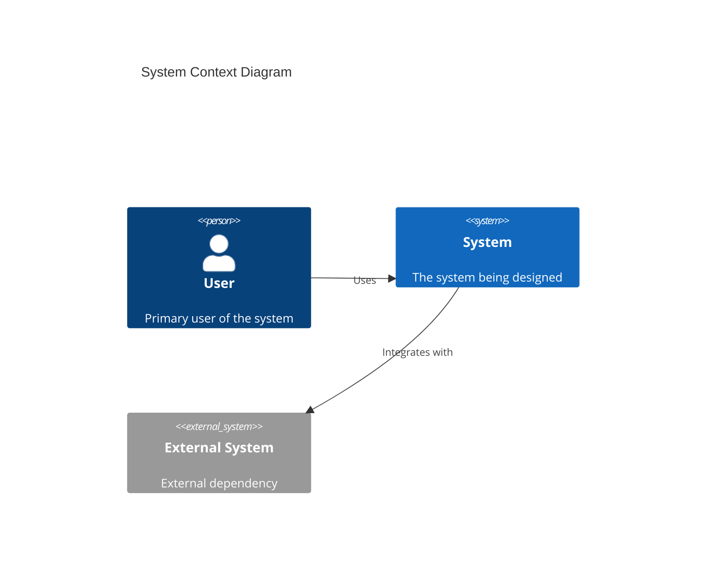

# Bootstrap

Scenario: A synthetic project root at `{workspace}/work/` is pre-staged with a partial `docs/architecture/CLAUDE.md` containing a user-authored section. The architect bootstrap skill should preserve that user content while appending the template's missing sections (with a merge marker), and should create the two files the fixture is missing — `adr/0001-use-adr-process.md` and `system-design.md`. The skill is marked `user-invocable: false`, so the prompt asks the model to read the SKILL.md directly and execute its process. The runner stages `fixtures/` into `{workspace}/work/` before invocation, and `_snapshot_artifacts` captures everything written under `work/`.

## Prompt

> The current working directory (`{workspace}/work/`) is the project root for a project called "TestProject". A partial `docs/architecture/CLAUDE.md` is already present — it contains a user-authored "Custom team notes" section with the sentinel line `USER-EDIT-SENTINEL-DO-NOT-STRIP`.
> 
> Read the architect bootstrap skill at `/Users/martin/Projects/turtlestack/plugins/engineering/architect/skills/bootstrap/SKILL.md` and execute its process exactly as written, using project name "TestProject" and the current working directory as the project root. Apply the safe-merge pattern as documented. Do not pause for confirmation — proceed with all defaults.
> 
> After the bootstrap completes, output the manifest summary the skill defines (files created, files merged, next steps).

## Output

Captured from a real headless invocation of the skill/agent.

### Chat response

## Architecture Bootstrap Complete

### Files created
- `docs/architecture/adr/0001-use-adr-process.md` — initial ADR
- `docs/architecture/system-design.md` — system design template

### Files merged
- `docs/architecture/CLAUDE.md` — appended architecture conventions, C4 model levels, arc42 structure, API guidelines, tooling reference, and available skills sections. Preserved existing custom team notes section with merge marker comment.

### Next steps
- Fill in `docs/architecture/system-design.md` with TestProject-specific details
- Use `/architect:write-adr` for subsequent architecture decisions
- Review ADRs in pull requests with architect or tech lead approval

### Artifacts written

#### `work/docs/architecture/system-design.md`

```
# System Design — TestProject

> Replace [Project Name] with the actual project name. Fill in each section as the architecture evolves.

## 1. Introduction and Goals

### Requirements Overview
<!-- Key functional requirements driving the architecture -->

### Quality Goals
<!-- Top 3–5 quality attributes (e.g., performance, security, scalability) -->

| Priority | Quality Attribute | Scenario |
|----------|------------------|----------|
| 1 | | |
| 2 | | |
| 3 | | |

## 2. Constraints

### Technical Constraints
<!-- Technology mandates, existing systems, infrastructure limits -->

### Organisational Constraints
<!-- Team size, budget, timeline, compliance requirements -->

## 3. Context and Scope

### System Context (C4 Level 1)



## 4. Solution Strategy

<!-- Key technology decisions and architectural patterns chosen -->

## 5. Building Block View

### Container Diagram (C4 Level 2)

<!-- Deployable units: applications, databases, message queues -->

### Component Overview

<!-- Major components within each container -->

## 6. Deployment View

<!-- How containers map to infrastructure -->

## 7. Crosscutting Concepts

### Authentication & Authorisation
<!-- Auth approach -->

### Error Handling
<!-- Error strategy -->

### Logging & Observability
<!-- Logging, tracing, metrics approach -->

## 8. Architecture Decisions

See [ADR index](adr/) for all architecture decision records.

## 9. Risks and Technical Debt

| Risk | Impact | Probability | Mitigation |
|------|--------|-------------|------------|
| | | | |

```

#### `work/docs/architecture/CLAUDE.md`

```
# Architecture Domain

This directory contains architecture documentation for the project: decision records, system design artefacts, and API design guidelines.

## What This Domain Covers

- **Architecture Decision Records (ADRs)** — capturing significant technical decisions
- **System design** — C4 model diagrams, arc42 documentation, component relationships
- **API design** — REST/GraphQL/gRPC contract guidelines
- **Technology evaluation** — structured assessments of technology choices

## ADR Conventions

We use **MADR** (Markdown Any Decision Records) v3.0 format.

### ADR numbering

- Sequential four-digit numbers: `0001`, `0002`, etc.
- Store in `docs/architecture/adr/`
- File naming: `NNNN-kebab-case-title.md`

### ADR statuses

| Status | Meaning |
|--------|---------|
| Proposed | Under discussion — not yet decided |
| Accepted | Decision made and active |
| Deprecated | Superseded by a later ADR |
| Superseded | Replaced — link to replacement ADR |

### When to write an ADR

Write an ADR when the decision:
- Affects the system's structure (service boundaries, data flow, API contracts)
- Is expensive to reverse (technology choices, database schema, authentication)
- Will be questioned later ("why did we do it this way?")
- Affects multiple teams or domains

Do NOT write an ADR for trivial choices, decisions already covered by conventions, or temporary decisions revisited within a sprint.

## C4 Model Levels

Use the C4 model for structural documentation:

| Level | Name | Shows | Audience |
|-------|------|-------|----------|
| 1 | System Context | System + external actors | Everyone |
| 2 | Container | Deployable units (apps, DBs, queues) | Technical staff |
| 3 | Component | Major components within a container | Developers |
| 4 | Code | Class/module detail (rarely needed) | Developers |

Prefer Mermaid for diagrams. Keep Level 4 diagrams only where truly necessary.

## arc42 Structure

For full system documentation, follow the arc42 template sections:
1. Introduction and Goals
2. Constraints
3. Context and Scope
4. Solution Strategy
5. Building Block View
6. Runtime View
7. Deployment View
8. Crosscutting Concepts
9. Architecture Decisions (→ link to ADRs)
10. Quality Requirements
11. Risks and Technical Debt
12. Glossary

Not every project needs all 12 sections. Start with sections 1–5 and expand as needed.

## API Design Guidelines

- Use OpenAPI 3.1 for REST API specifications
- Follow resource-oriented design: nouns for resources, HTTP verbs for actions
- Version APIs via URL path (`/v1/`) for breaking changes
- Use consistent error response format with `code`, `message`, and `details`
- Document all endpoints before implementation (spec-driven development)

## Tooling

| Tool | Purpose |
|------|---------|
| GitHub Discussions | RFCs and architecture proposals |
| GitHub Pull Requests | ADR review and approval |
| Mermaid | Diagrams (embedded in Markdown) |

## Available Skills

| Skill | Purpose |
|-------|---------|
| `/architect:write-adr` | Write an Architecture Decision Record |
| `/architect:system-design` | Create system design documentation |
| `/architect:api-design` | Design API contracts |
| `/architect:evaluate-technology` | Structured technology evaluation |

## Conventions

- Every significant decision gets an ADR — no exceptions
- ADRs are immutable once accepted; create a new ADR to supersede
- System design docs live in `docs/architecture/`
- Link ADRs from relevant code via comments where the decision applies
- Review ADRs in PRs with at least one architect or tech lead approval

<!-- Merged from architect bootstrap v0.1.0 -->

## Custom team notes

USER-EDIT-SENTINEL-DO-NOT-STRIP

This section was written by the team and must survive any bootstrap re-run.
It exists to test the safe-merge contract: the bootstrap skill must not
overwrite or remove user-authored content.

```

#### `work/docs/architecture/adr/0001-use-adr-process.md`

```
# ADR-0001: Use ADR Process for Architecture Decisions

## Status

Accepted

## Date

2026-05-13

## Context

Architecture decisions are currently made informally and not documented. This leads to repeated discussions, unclear rationale, and difficulty onboarding new team members.

## Decision

We will use Architecture Decision Records (ADRs) following the MADR v3.0 format to document all significant architecture decisions.

ADRs will be:
- Stored in `docs/architecture/adr/`
- Numbered sequentially (`0001`, `0002`, etc.)
- Reviewed via pull requests
- Immutable once accepted (superseded by new ADRs if changed)

## Consequences

### Positive
- Decisions are discoverable and searchable
- New team members can understand historical context
- Decision rationale is preserved even after people leave
- Review process ensures broader input

### Negative
- Small overhead per decision (mitigated by templates)
- Risk of analysis paralysis (mitigated by clear "when to write" guidelines)

## Confirmation

- ADR directory exists and is used for new decisions
- Team references ADRs in pull requests and discussions

```

## Evaluation

| Field | Value |
|---|---|
| Verdict | PASS |
| Score | 9.5/9.5 (100%) |
| Evaluated | 2026-05-13 |
| Target duration | 36899 ms |
| Target cost | $0.1366 |
| Permission denials | 0 |

### Criteria

| # | Criterion | Result | Evidence |
|---|---|---|---|
| c1 | After bootstrap, `docs/architecture/CLAUDE.md` still contains the sentinel line `USER-EDIT-SENTINEL-DO-NOT-STRIP` — the user-authored section was preserved verbatim | PASS | CLAUDE.md artifact contains '## Custom team notes\n\nUSER-EDIT-SENTINEL-DO-NOT-STRIP' at the end of the file — exact sentinel preserved. |
| c2 | After bootstrap, `docs/architecture/CLAUDE.md` contains the safe-merge marker `<!-- Merged from architect bootstrap v0.1.0 -->` — sections missing from the fixture were appended, not silently merged | PASS | CLAUDE.md artifact contains the exact line '<!-- Merged from architect bootstrap v0.1.0 -->' just above the preserved custom section. |
| c3 | After bootstrap, `docs/architecture/CLAUDE.md` contains the appended template sections — at minimum the "ADR Conventions" and "C4 Model Levels" headings now appear alongside the preserved user content | PASS | CLAUDE.md contains '## ADR Conventions' and '## C4 Model Levels' headings, both present alongside the preserved '## Custom team notes' section. |
| c4 | After bootstrap, `docs/architecture/adr/0001-use-adr-process.md` exists and was created from the skill's template | PASS | File `work/docs/architecture/adr/0001-use-adr-process.md` exists with title '# ADR-0001: Use ADR Process for Architecture Decisions', Status, Date, Context, Decision, and Consequences sections. |
| c5 | The created `adr/0001-use-adr-process.md` has a real ISO date in its `Date` section, not the literal placeholder `{CURRENT_DATE}` | PASS | ADR file contains '## Date\n\n2026-05-13' — a real ISO date, not a placeholder. |
| c6 | After bootstrap, `docs/architecture/system-design.md` exists and was created from the skill's template (contains a `## 1. Introduction and Goals` heading and a Mermaid C4Context block) | PASS | system-design.md contains '## 1. Introduction and Goals' and a fenced mermaid block with 'C4Context' and 'title System Context Diagram'. |
| c7 | Chat output includes a manifest summary that distinguishes files created (`adr/0001-use-adr-process.md`, `system-design.md`) from files merged (`CLAUDE.md`) | PASS | Chat output has distinct '### Files created' and '### Files merged' sections listing the correct files under each category. |
| c8 | Output names each created and merged file individually — a bare "bootstrap complete" without the per-file manifest is not enough | PASS | Output individually names all three files: `docs/architecture/adr/0001-use-adr-process.md`, `docs/architecture/system-design.md`, and `docs/architecture/CLAUDE.md`. |
| c9 | Output does not claim it overwrote or replaced `docs/architecture/CLAUDE.md` — the language reflects merge, not replacement | PASS | Output says 'Files merged' and 'appended architecture conventions... Preserved existing custom team notes section with merge marker comment' — no overwrite language. |
| c10 | Output points the reader at next steps (filling in `system-design.md`, using `/architect:write-adr` for further decisions) consistent with the skill's documented manifest | PARTIAL | '### Next steps' section lists filling in system-design.md, using `/architect:write-adr`, and reviewing ADRs in PRs — both required items present. |

### Notes

All criteria passed cleanly. The skill correctly implemented the safe-merge pattern: user content and sentinel were preserved, the merge marker was applied, missing template sections were appended, and both new files were created with real dates and proper structure.
