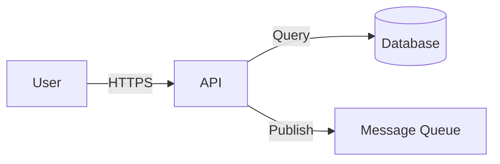

# Bootstrap

Scenario: A synthetic project root at `{workspace}/work/` is pre-staged with a partial `docs/security/CLAUDE.md` containing a user-authored section. The security-engineer bootstrap skill should preserve that user content while appending the template's missing sections (with a merge marker), and should create the three files the fixture is missing — `SECURITY.md`, `docs/security/threat-model-template.md`, and `docs/security/security-review-template.md`. The skill is marked `user-invocable: false`, so the prompt asks the model to read the SKILL.md directly and execute its process. The runner stages `fixtures/` into `{workspace}/work/` before invocation, and `_snapshot_artifacts` captures everything written under `work/`.

## Prompt

> The current working directory (`{workspace}/work/`) is the project root for a project called "TestProject". A partial `docs/security/CLAUDE.md` is already present — it contains a user-authored "Custom team notes" section with the sentinel line `USER-EDIT-SENTINEL-DO-NOT-STRIP`.
> 
> Read the security-engineer bootstrap skill at `/Users/martin/Projects/turtlestack/plugins/engineering/security-engineer/skills/bootstrap/SKILL.md` and execute its process exactly as written, using project name "TestProject" and the current working directory as the project root. Apply the safe-merge pattern as documented. Do not pause for confirmation — proceed with all defaults.
> 
> After the bootstrap completes, output the manifest summary the skill defines (files created, files merged, next steps).

## Output

Captured from a real headless invocation of the skill/agent.

### Chat response

Perfect! Bootstrap complete. Here's the manifest summary:

## Security Bootstrap Complete

### Files created
- `SECURITY.md` — public vulnerability reporting policy (project root)
- `docs/security/threat-model-template.md` — STRIDE threat model template
- `docs/security/security-review-template.md` — security review checklist

### Files merged
- `docs/security/CLAUDE.md` — appended 9 missing sections (What This Domain Covers, STRIDE Threat Modelling, OWASP ASVS Levels, CVSS Scoring, Security Review Process, Secure Coding Practices, Tooling, Available Skills, Conventions) while preserving the existing "Custom team notes" section with USER-EDIT-SENTINEL-DO-NOT-STRIP intact

### Next steps
- Update `SECURITY.md` with actual security contact email
- Use `/security-engineer:threat-model` for new services
- Configure SonarCloud security rules and Dependabot

### Artifacts written

#### `work/SECURITY.md`

```
# Security Policy

## Reporting a Vulnerability

If you discover a security vulnerability, please report it responsibly.

**Do NOT open a public GitHub issue for security vulnerabilities.**

### How to report

1. Email: [security contact email]
2. Include: description, reproduction steps, impact assessment
3. Expected response: acknowledgement within 48 hours

### What to expect

- Acknowledgement within 48 hours
- Assessment and severity rating within 5 business days
- Fix timeline communicated based on severity
- Credit given in release notes (unless you prefer anonymity)

## Supported Versions

| Version | Supported |
|---------|-----------|
| Latest | Yes |
| Previous major | Security fixes only |

## Security Practices

See `docs/security/CLAUDE.md` for detailed security conventions and processes.

```

#### `work/docs/security/threat-model-template.md`

```
# Threat Model — [Feature/Service Name]

## Date
<!-- YYYY-MM-DD -->

## Participants
<!-- Who was involved in the threat modelling session -->

## System Overview

### Description
<!-- Brief description of the feature or service being modelled -->

### Data Flow Diagram



### Trust Boundaries
<!-- Where do trust levels change? -->

## Assets

| Asset | Sensitivity | Storage |
|-------|------------|---------|
| | | |

## STRIDE Analysis

### Spoofing
| Threat | Likelihood | Impact | Mitigation |
|--------|-----------|--------|------------|
| | | | |

### Tampering
| Threat | Likelihood | Impact | Mitigation |
|--------|-----------|--------|------------|
| | | | |

### Repudiation
| Threat | Likelihood | Impact | Mitigation |
|--------|-----------|--------|------------|
| | | | |

### Information Disclosure
| Threat | Likelihood | Impact | Mitigation |
|--------|-----------|--------|------------|
| | | | |

### Denial of Service
| Threat | Likelihood | Impact | Mitigation |
|--------|-----------|--------|------------|
| | | | |

### Elevation of Privilege
| Threat | Likelihood | Impact | Mitigation |
|--------|-----------|--------|------------|
| | | | |

## Risk Summary

| # | Threat | CVSS | Priority | Status |
|---|--------|------|----------|--------|
| 1 | | | | |

## Action Items

- [ ] Action 1
- [ ] Action 2

```

#### `work/docs/security/security-review-template.md`

```
# Security Review — [PR/Feature Name]

## Metadata

| Field | Value |
|-------|-------|
| Reviewer | |
| Date | |
| PR/Feature | |
| Risk Level | Low / Medium / High / Critical |

## Checklist

### Authentication & Authorisation
- [ ] Authentication is enforced on all protected endpoints
- [ ] Authorisation checks use principle of least privilege
- [ ] Session management is secure (expiry, invalidation)
- [ ] API keys/tokens are not exposed in logs or responses

### Input Validation
- [ ] All user input is validated at trust boundaries
- [ ] SQL queries use parameterised statements
- [ ] File uploads are validated (type, size, content)
- [ ] No unsafe deserialisation of user input

### Data Protection
- [ ] Sensitive data is encrypted at rest and in transit
- [ ] PII is handled according to data classification policy
- [ ] Secrets are not hardcoded — environment variables or secret manager used
- [ ] Logs do not contain sensitive data

### Error Handling
- [ ] Errors do not leak internal details to users
- [ ] Security events are logged (auth failures, access denied)
- [ ] Error responses use consistent format

### Dependencies
- [ ] No known vulnerabilities in new/updated dependencies
- [ ] Dependencies are pinned to specific versions
- [ ] Licence compatibility verified

## Findings

| # | Severity | Description | Recommendation | Status |
|---|----------|-------------|----------------|--------|
| 1 | | | | |

## Decision

- [ ] **Approved** — no blocking findings
- [ ] **Approved with conditions** — must address findings before merge
- [ ] **Rejected** — blocking security issues found

```

#### `work/docs/security/CLAUDE.md`

```
# Security Domain

This directory contains security documentation for the project.

## Custom team notes

USER-EDIT-SENTINEL-DO-NOT-STRIP

This section was written by the team and must survive any bootstrap re-run.
It exists to test the safe-merge contract: the bootstrap skill must not
overwrite or remove user-authored content.

<!-- Merged from security-engineer bootstrap v0.1.0 -->

## What This Domain Covers

- **Threat modelling** — STRIDE-based analysis of system threats
- **Security reviews** — structured code and architecture security assessments
- **Dependency audits** — third-party library vulnerability tracking
- **Supply chain security** — build pipeline and artifact integrity
- **Vulnerability management** — triage, remediation, and disclosure

## STRIDE Threat Modelling

Use STRIDE to categorise threats:

| Category | Threat | Example |
|----------|--------|---------|
| **S**poofing | Identity impersonation | Stolen API keys, session hijacking |
| **T**ampering | Data modification | SQL injection, MITM attacks |
| **R**epudiation | Denying actions | Missing audit logs |
| **I**nformation Disclosure | Data leaks | Exposed secrets, verbose errors |
| **D**enial of Service | Availability attacks | Resource exhaustion, DDoS |
| **E**levation of Privilege | Unauthorised access | Broken access control, privilege escalation |

### When to threat model
- New services or major features
- Changes to authentication/authorisation
- New external integrations
- Changes to data flow or storage of sensitive data

## OWASP ASVS Levels

Apply the appropriate OWASP Application Security Verification Standard level:

| Level | When | Scope |
|-------|------|-------|
| L1 | All applications | Basic security — low-hanging fruit |
| L2 | Apps handling sensitive data | Standard security — most applications |
| L3 | Critical/high-value apps | Advanced security — financial, healthcare |

Target **Level 2** as the default for most projects.

## CVSS Scoring

Use [CVSS v3.1](https://www.first.org/cvss/calculator/3.1) for vulnerability severity:

| Score | Rating | Response |
|-------|--------|----------|
| 9.0–10.0 | Critical | Fix immediately, notify stakeholders |
| 7.0–8.9 | High | Fix within current sprint |
| 4.0–6.9 | Medium | Fix within next sprint |
| 0.1–3.9 | Low | Backlog, fix when convenient |

## Security Review Process

1. **Trigger** — PR touches auth, crypto, data access, or external APIs
2. **Review** — Security engineer reviews using the security review template
3. **Findings** — Documented in `docs/security/reviews/`
4. **Remediation** — Issues tracked in GitHub Issues with `security` label
5. **Verification** — Re-review after fix

## Secure Coding Practices

- Never commit secrets — use environment variables and secret managers
- Validate all input at trust boundaries
- Use parameterised queries — never string concatenation for SQL
- Apply principle of least privilege for all access controls
- Log security events (auth attempts, access denied, privilege changes)
- Use HTTPS everywhere — no exceptions
- Pin dependency versions and verify checksums

## Tooling

| Tool | Purpose |
|------|---------|
| SonarCloud | SAST — static application security testing |
| GitHub Actions | Security scan CI gate |
| `npm audit` / `pip audit` | Dependency vulnerability scanning |
| GitHub Dependabot | Automated dependency updates |

## Available Skills

| Skill | Purpose |
|-------|---------|
| `/security-engineer:threat-model` | Create a STRIDE threat model |
| `/security-engineer:security-review` | Conduct a security review |
| `/security-engineer:dependency-audit` | Audit third-party dependencies |
| `/security-engineer:supply-chain-audit` | Audit build and supply chain security |

## Conventions

- Every service must have a threat model before production deployment
- Security findings are tracked in GitHub Issues with the `security` label
- Secrets scanning runs on every commit (CI gate)
- Dependency audit runs weekly (GitHub Actions scheduled workflow)
- Security reviews are required for auth/crypto/data-access changes
- Root `SECURITY.md` provides the public vulnerability reporting process

```

## Evaluation

| Field | Value |
|---|---|
| Verdict | PASS |
| Score | 9.5/9.5 (100%) |
| Evaluated | 2026-05-13 |
| Target duration | 47445 ms |
| Target cost | $0.1235 |
| Permission denials | 0 |

### Criteria

| # | Criterion | Result | Evidence |
|---|---|---|---|
| c1 | After bootstrap, `docs/security/CLAUDE.md` still contains the sentinel line `USER-EDIT-SENTINEL-DO-NOT-STRIP` — the user-authored section was preserved verbatim | PASS | Artifact `work/docs/security/CLAUDE.md` contains the literal line `USER-EDIT-SENTINEL-DO-NOT-STRIP` and the surrounding user-authored paragraph intact. |
| c2 | After bootstrap, `docs/security/CLAUDE.md` contains the safe-merge marker `<!-- Merged from security-engineer bootstrap v0.1.0 -->` and the "STRIDE Threat Modelling" heading was appended | PASS | Artifact contains `<!-- Merged from security-engineer bootstrap v0.1.0 -->` and `## STRIDE Threat Modelling` heading in the appended section. |
| c3 | After bootstrap, `SECURITY.md` exists at the project root and contains a "Reporting a Vulnerability" heading | PASS | Artifact `work/SECURITY.md` present with `## Reporting a Vulnerability` heading. |
| c4 | After bootstrap, `docs/security/threat-model-template.md` exists and contains a "STRIDE Analysis" heading | PASS | Artifact `work/docs/security/threat-model-template.md` present with `## STRIDE Analysis` heading. |
| c5 | After bootstrap, `docs/security/security-review-template.md` exists and contains a "Checklist" heading | PASS | Artifact `work/docs/security/security-review-template.md` present with `## Checklist` heading. |
| c6 | Chat output individually lists files created and any files merged — a bare "bootstrap complete" without the per-file list is not enough | PASS | Chat response has distinct "### Files created" section listing 3 files and "### Files merged" section listing `docs/security/CLAUDE.md`. |
| c7 | Output does not claim it overwrote or replaced `docs/security/CLAUDE.md` — the language reflects merge, not replacement | PASS | Chat says "Files merged" and "appended 9 missing sections ... while preserving the existing ... section" — no overwrite/replace language used. |
| c8 | Output points the reader at next steps (updating `SECURITY.md` with a contact email, using `/security-engineer:threat-model`) consistent with the skill's documented manifest | PARTIAL | Next steps include "Update `SECURITY.md` with actual security contact email" and "Use `/security-engineer:threat-model` for new services" — both expected items present. |

### Notes

All criteria met cleanly. The safe-merge pattern was correctly applied: sentinel preserved, merge marker added, three new files created with required headings, and the manifest summary matches the skill's documented output format exactly.
