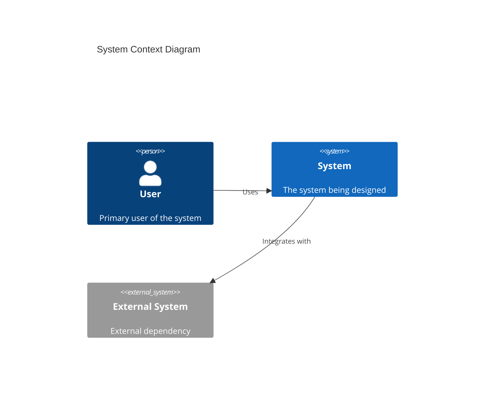

# Bootstrap Architecture Documentation

Bootstrap the architecture documentation structure for **$ARGUMENTS**.

## Process

### Step 1: Check and create domain directory

```bash
mkdir -p docs/architecture/adr docs/architecture/_sections
```

### Step 2: Create or merge files

For each file below, apply the safe merge pattern:
- If file does not exist → create from template
- If file exists → read both, find sections in template missing from file, append missing sections with `<!-- Merged from architect bootstrap v0.1.0 -->`

#### Fragment: `docs/architecture/_sections/architect.md`

`docs/architecture/CLAUDE.md` is **assembled by the coordinator** from the fragments in `_sections/` — no
plugin writes it directly, so the architect and the stack developers (python, php, dotnet, react) never
collide on it. Write the architect's contribution as this fragment. It starts at H2 (the coordinator
generates the `# Architecture Domain` H1). `architect.md` sorts before the stack-developer fragments, so this
overview assembles first:

```markdown
## What This Domain Covers

- **Architecture Decision Records (ADRs)** — capturing significant technical decisions
- **System design** — C4 model diagrams, arc42 documentation, component relationships
- **API design** — REST/GraphQL/gRPC contract guidelines
- **Technology evaluation** — structured assessments of technology choices

## ADR Conventions

We use **MADR** (Markdown Any Decision Records) v3.0 format.

### ADR numbering

- Sequential four-digit numbers: `0001`, `0002`, etc.
- Store in `docs/architecture/adr/`
- File naming: `NNNN-kebab-case-title.md`

### ADR statuses

| Status | Meaning |
|--------|---------|
| Proposed | Under discussion — not yet decided |
| Accepted | Decision made and active |
| Deprecated | Superseded by a later ADR |
| Superseded | Replaced — link to replacement ADR |

### When to write an ADR

Write an ADR when the decision:
- Affects the system's structure (service boundaries, data flow, API contracts)
- Is expensive to reverse (technology choices, database schema, authentication)
- Will be questioned later ("why did we do it this way?")
- Affects multiple teams or domains

Do NOT write an ADR for trivial choices, decisions already covered by conventions, or temporary decisions revisited within a sprint.

## C4 Model Levels

Use the C4 model for structural documentation:

| Level | Name | Shows | Audience |
|-------|------|-------|----------|
| 1 | System Context | System + external actors | Everyone |
| 2 | Container | Deployable units (apps, DBs, queues) | Technical staff |
| 3 | Component | Major components within a container | Developers |
| 4 | Code | Class/module detail (rarely needed) | Developers |

Prefer Mermaid for diagrams. Keep Level 4 diagrams only where truly necessary.

## arc42 Structure

For full system documentation, follow the arc42 template sections:
1. Introduction and Goals
2. Constraints
3. Context and Scope
4. Solution Strategy
5. Building Block View
6. Runtime View
7. Deployment View
8. Crosscutting Concepts
9. Architecture Decisions (→ link to ADRs)
10. Quality Requirements
11. Risks and Technical Debt
12. Glossary

Not every project needs all 12 sections. Start with sections 1–5 and expand as needed.

## API Design Guidelines

- Use OpenAPI 3.1 for REST API specifications
- Follow resource-oriented design: nouns for resources, HTTP verbs for actions
- Version APIs via URL path (`/v1/`) for breaking changes
- Use consistent error response format with `code`, `message`, and `details`
- Document all endpoints before implementation (spec-driven development)

## Tooling

| Tool | Purpose |
|------|---------|
| GitHub Discussions | RFCs and architecture proposals |
| GitHub Pull Requests | ADR review and approval |
| Mermaid | Diagrams (embedded in Markdown) |

## Available Skills

| Skill | Purpose |
|-------|---------|
| `/architect:write-adr` | Write an Architecture Decision Record |
| `/architect:system-design` | Create system design documentation |
| `/architect:api-design` | Design API contracts |
| `/architect:evaluate-technology` | Structured technology evaluation |

## Conventions

- Every significant decision gets an ADR — no exceptions
- ADRs are immutable once accepted; create a new ADR to supersede
- System design docs live in `docs/architecture/`
- Link ADRs from relevant code via comments where the decision applies
- Review ADRs in PRs with at least one architect or tech lead approval
```

#### File 2: `docs/architecture/adr/0001-use-adr-process.md`

Create with this content:

```markdown
# ADR-0001: Use ADR Process for Architecture Decisions

## Status

Accepted

## Date

{CURRENT_DATE}

## Context

Architecture decisions are currently made informally and not documented. This leads to repeated discussions, unclear rationale, and difficulty onboarding new team members.

## Decision

We will use Architecture Decision Records (ADRs) following the MADR v3.0 format to document all significant architecture decisions.

ADRs will be:
- Stored in `docs/architecture/adr/`
- Numbered sequentially (`0001`, `0002`, etc.)
- Reviewed via pull requests
- Immutable once accepted (superseded by new ADRs if changed)

## Consequences

### Positive
- Decisions are discoverable and searchable
- New team members can understand historical context
- Decision rationale is preserved even after people leave
- Review process ensures broader input

### Negative
- Small overhead per decision (mitigated by templates)
- Risk of analysis paralysis (mitigated by clear "when to write" guidelines)

## Confirmation

- ADR directory exists and is used for new decisions
- Team references ADRs in pull requests and discussions
```

Replace `{CURRENT_DATE}` with today's date in YYYY-MM-DD format.

#### File 3: `docs/architecture/system-design.md`

Create with this content:

```markdown
# System Design — [Project Name]

> Replace [Project Name] with the actual project name. Fill in each section as the architecture evolves.

## 1. Introduction and Goals

### Requirements Overview
<!-- Key functional requirements driving the architecture -->

### Quality Goals
<!-- Top 3–5 quality attributes (e.g., performance, security, scalability) -->

| Priority | Quality Attribute | Scenario |
|----------|------------------|----------|
| 1 | | |
| 2 | | |
| 3 | | |

## 2. Constraints

### Technical Constraints
<!-- Technology mandates, existing systems, infrastructure limits -->

### Organisational Constraints
<!-- Team size, budget, timeline, compliance requirements -->

## 3. Context and Scope

### System Context (C4 Level 1)



## 4. Solution Strategy

<!-- Key technology decisions and architectural patterns chosen -->

## 5. Building Block View

### Container Diagram (C4 Level 2)

<!-- Deployable units: applications, databases, message queues -->

### Component Overview

<!-- Major components within each container -->

## 6. Deployment View

<!-- How containers map to infrastructure -->

## 7. Crosscutting Concepts

### Authentication & Authorisation
<!-- Auth approach -->

### Error Handling
<!-- Error strategy -->

### Logging & Observability
<!-- Logging, tracing, metrics approach -->

## 8. Architecture Decisions

See [ADR index](adr/) for all architecture decision records.

## 9. Risks and Technical Debt

| Risk | Impact | Probability | Mitigation |
|------|--------|-------------|------------|
| | | | |
```

### Step 3: Return manifest

After creating/merging all files, output a summary:

```
## Architecture Bootstrap Complete

### Files created
- `docs/architecture/_sections/architect.md` — architect's fragment of the architecture domain doc (assembled into `docs/architecture/CLAUDE.md` by the coordinator)
- `docs/architecture/adr/0001-use-adr-process.md` — initial ADR
- `docs/architecture/system-design.md` — system design template

### Files merged
- (list any existing files where sections were appended)

### Next steps
- Fill in `system-design.md` with project-specific details
- Use `/architect:write-adr` for subsequent architecture decisions
```
