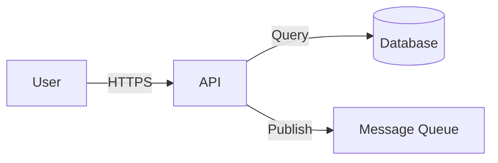

# Bootstrap Security Documentation

Bootstrap the security documentation structure for **$ARGUMENTS**.

## Process

### Step 1: Check and create domain directory

```bash
mkdir -p docs/security docs/security/_sections
```

### Step 2: Create or merge files

For each file below, apply the safe merge pattern:
- If file does not exist → create from template
- If file exists → read both, find sections in template missing from file, append missing sections with `<!-- Merged from security-engineer bootstrap v0.1.0 -->`

#### File 1: `SECURITY.md` (project root)

Create with this content:

```markdown
# Security Policy

## Reporting a Vulnerability

If you discover a security vulnerability, please report it responsibly.

**Do NOT open a public GitHub issue for security vulnerabilities.**

### How to report

1. Email: [security contact email]
2. Include: description, reproduction steps, impact assessment
3. Expected response: acknowledgement within 48 hours

### What to expect

- Acknowledgement within 48 hours
- Assessment and severity rating within 5 business days
- Fix timeline communicated based on severity
- Credit given in release notes (unless you prefer anonymity)

## Supported Versions

| Version | Supported |
|---------|-----------|
| Latest | Yes |
| Previous major | Security fixes only |

## Security Practices

See `docs/security/CLAUDE.md` for detailed security conventions and processes.
```

#### Fragment: `docs/security/_sections/security-engineer.md`

`docs/security/CLAUDE.md` is **assembled by the coordinator** from the fragments in `_sections/` — no plugin
writes it directly. Write the security-engineer's contribution as this fragment. It starts at H2 (the
coordinator generates the `# Security Domain` H1 and a one-line intro). Create it with this content:

```markdown
## What This Domain Covers

- **Threat modelling** — STRIDE-based analysis of system threats
- **Security reviews** — structured code and architecture security assessments
- **Dependency audits** — third-party library vulnerability tracking
- **Supply chain security** — build pipeline and artifact integrity
- **Vulnerability management** — triage, remediation, and disclosure

## STRIDE Threat Modelling

Use STRIDE to categorise threats:

| Category | Threat | Example |
|----------|--------|---------|
| **S**poofing | Identity impersonation | Stolen API keys, session hijacking |
| **T**ampering | Data modification | SQL injection, MITM attacks |
| **R**epudiation | Denying actions | Missing audit logs |
| **I**nformation Disclosure | Data leaks | Exposed secrets, verbose errors |
| **D**enial of Service | Availability attacks | Resource exhaustion, DDoS |
| **E**levation of Privilege | Unauthorised access | Broken access control, privilege escalation |

### When to threat model
- New services or major features
- Changes to authentication/authorisation
- New external integrations
- Changes to data flow or storage of sensitive data

## OWASP ASVS Levels

Apply the appropriate OWASP Application Security Verification Standard level:

| Level | When | Scope |
|-------|------|-------|
| L1 | All applications | Basic security — low-hanging fruit |
| L2 | Apps handling sensitive data | Standard security — most applications |
| L3 | Critical/high-value apps | Advanced security — financial, healthcare |

Target **Level 2** as the default for most projects.

## CVSS Scoring

Use [CVSS v3.1](https://www.first.org/cvss/calculator/3.1) for vulnerability severity:

| Score | Rating | Response |
|-------|--------|----------|
| 9.0–10.0 | Critical | Fix immediately, notify stakeholders |
| 7.0–8.9 | High | Fix within current sprint |
| 4.0–6.9 | Medium | Fix within next sprint |
| 0.1–3.9 | Low | Backlog, fix when convenient |

## Security Review Process

1. **Trigger** — PR touches auth, crypto, data access, or external APIs
2. **Review** — Security engineer reviews using the security review template
3. **Findings** — Documented in `docs/security/reviews/`
4. **Remediation** — Issues tracked in GitHub Issues with `security` label
5. **Verification** — Re-review after fix

## Secure Coding Practices

- Never commit secrets — use environment variables and secret managers
- Validate all input at trust boundaries
- Use parameterised queries — never string concatenation for SQL
- Apply principle of least privilege for all access controls
- Log security events (auth attempts, access denied, privilege changes)
- Use HTTPS everywhere — no exceptions
- Pin dependency versions and verify checksums

## Tooling

| Tool | Purpose |
|------|---------|
| SonarCloud | SAST — static application security testing |
| GitHub Actions | Security scan CI gate |
| `npm audit` / `pip audit` | Dependency vulnerability scanning |
| GitHub Dependabot | Automated dependency updates |

## Available Skills

| Skill | Purpose |
|-------|---------|
| `/security-engineer:threat-model` | Create a STRIDE threat model |
| `/security-engineer:security-review` | Conduct a security review |
| `/security-engineer:dependency-audit` | Audit third-party dependencies |
| `/security-engineer:supply-chain-audit` | Audit build and supply chain security |

## Conventions

- Every service must have a threat model before production deployment
- Security findings are tracked in GitHub Issues with the `security` label
- Secrets scanning runs on every commit (CI gate)
- Dependency audit runs weekly (GitHub Actions scheduled workflow)
- Security reviews are required for auth/crypto/data-access changes
- Root `SECURITY.md` provides the public vulnerability reporting process
```

#### File 3: `docs/security/threat-model-template.md`

Create with this content:

```markdown
# Threat Model — [Feature/Service Name]

## Date
<!-- YYYY-MM-DD -->

## Participants
<!-- Who was involved in the threat modelling session -->

## System Overview

### Description
<!-- Brief description of the feature or service being modelled -->

### Data Flow Diagram



### Trust Boundaries
<!-- Where do trust levels change? -->

## Assets

| Asset | Sensitivity | Storage |
|-------|------------|---------|
| | | |

## STRIDE Analysis

### Spoofing
| Threat | Likelihood | Impact | Mitigation |
|--------|-----------|--------|------------|
| | | | |

### Tampering
| Threat | Likelihood | Impact | Mitigation |
|--------|-----------|--------|------------|
| | | | |

### Repudiation
| Threat | Likelihood | Impact | Mitigation |
|--------|-----------|--------|------------|
| | | | |

### Information Disclosure
| Threat | Likelihood | Impact | Mitigation |
|--------|-----------|--------|------------|
| | | | |

### Denial of Service
| Threat | Likelihood | Impact | Mitigation |
|--------|-----------|--------|------------|
| | | | |

### Elevation of Privilege
| Threat | Likelihood | Impact | Mitigation |
|--------|-----------|--------|------------|
| | | | |

## Risk Summary

| # | Threat | CVSS | Priority | Status |
|---|--------|------|----------|--------|
| 1 | | | | |

## Action Items

- [ ] Action 1
- [ ] Action 2
```

#### File 4: `docs/security/security-review-template.md`

Create with this content:

```markdown
# Security Review — [PR/Feature Name]

## Metadata

| Field | Value |
|-------|-------|
| Reviewer | |
| Date | |
| PR/Feature | |
| Risk Level | Low / Medium / High / Critical |

## Checklist

### Authentication & Authorisation
- [ ] Authentication is enforced on all protected endpoints
- [ ] Authorisation checks use principle of least privilege
- [ ] Session management is secure (expiry, invalidation)
- [ ] API keys/tokens are not exposed in logs or responses

### Input Validation
- [ ] All user input is validated at trust boundaries
- [ ] SQL queries use parameterised statements
- [ ] File uploads are validated (type, size, content)
- [ ] No unsafe deserialisation of user input

### Data Protection
- [ ] Sensitive data is encrypted at rest and in transit
- [ ] PII is handled according to data classification policy
- [ ] Secrets are not hardcoded — environment variables or secret manager used
- [ ] Logs do not contain sensitive data

### Error Handling
- [ ] Errors do not leak internal details to users
- [ ] Security events are logged (auth failures, access denied)
- [ ] Error responses use consistent format

### Dependencies
- [ ] No known vulnerabilities in new/updated dependencies
- [ ] Dependencies are pinned to specific versions
- [ ] Licence compatibility verified

## Findings

| # | Severity | Description | Recommendation | Status |
|---|----------|-------------|----------------|--------|
| 1 | | | | |

## Decision

- [ ] **Approved** — no blocking findings
- [ ] **Approved with conditions** — must address findings before merge
- [ ] **Rejected** — blocking security issues found
```

### Step 3: Return manifest

After creating/merging all files, output a summary:

```
## Security Bootstrap Complete

### Files created
- `SECURITY.md` — public vulnerability reporting policy (project root)
- `docs/security/_sections/security-engineer.md` — security-engineer fragment (coordinator assembles `docs/security/CLAUDE.md` from it)
- `docs/security/threat-model-template.md` — STRIDE threat model template
- `docs/security/security-review-template.md` — security review checklist

### Files merged
- (list any existing files where sections were appended)

### Next steps
- Update `SECURITY.md` with actual security contact email
- Use `/security-engineer:threat-model` for new services
- Configure SonarCloud security rules and Dependabot
```
